# Sirius · Manual de usuario administrador

**Laboratorio y Clínica Bosques Polanco**
Versión 1.0 · octubre de 2026

> Este manual es para quien **administra** Sirius: crea usuarios, decide qué ve cada persona, configura las conexiones externas, respalda la información y mantiene el sistema sano. **Da por sabido el Manual de usuario estándar**: todo lo que hace el personal (admisión, expedientes, tareas, inventario, pizarrón, archivos, calendario, WhatsApp y Apps) lo puede hacer también un administrador, y aquí solo se explica lo que **cambia o se añade** para ti.

> **Sobre las capturas.** Salen de un entorno de demostración con **datos ficticios**. Los números rojos se explican en el texto que las acompaña.

---

## Índice

1. [Qué es ser administrador](#1-qué-es-ser-administrador)
2. [El menú del administrador y Admin Tools](#2-el-menú-del-administrador-y-admin-tools)
3. [Usuarios y permisos](#3-usuarios-y-permisos)
4. [Empleados: ficha, jornada y vacaciones](#4-empleados-ficha-jornada-y-vacaciones)
5. [Conexiones externas (API)](#5-conexiones-externas-api)
6. [Membretes](#6-membretes)
7. [Catálogo de Estudios](#7-catálogo-de-estudios)
8. [Plantillas de Estudios](#8-plantillas-de-estudios)
9. [Vinculación y comisiones](#9-vinculación-y-comisiones)
10. [Cobertura](#10-cobertura)
11. [WhatsApp: configuración](#11-whatsapp-configuración)
12. [Backup: respaldar y restaurar](#12-backup-respaldar-y-restaurar)
13. [Papelera](#13-papelera)
14. [Log: la bitácora de actividad](#14-log-la-bitácora-de-actividad)
15. [Configuración de la aplicación](#15-configuración-de-la-aplicación)
16. [Lo que cambia para el administrador en los demás módulos](#16-lo-que-cambia-para-el-administrador-en-los-demás-módulos)
17. [Báscula Bluetooth (en preparación)](#17-báscula-bluetooth-en-preparación)
18. [Rutina de administración](#18-rutina-de-administración)
19. [Seguridad y buenas prácticas](#19-seguridad-y-buenas-prácticas)
20. [Instalación, actualizaciones y tareas programadas](#20-instalación-actualizaciones-y-tareas-programadas)
21. [Solución de problemas](#21-solución-de-problemas)

---

## 1. Qué es ser administrador

Sirius tiene tres roles:

| Rol | Qué puede hacer |
|---|---|
| **Estándar** | Solo lo que le habilitas: **módulos** concretos y, dentro de cada uno, **privilegios** concretos. |
| **Administrador** | **Todo**: todos los módulos, todos los privilegios, todas las herramientas de Admin Tools y los expedientes de todos los responsables. |
| **Developper** | Idéntico al administrador en la práctica (es el rol de quien da mantenimiento técnico al sistema). |

Dos reglas importantes:

- **Un administrador no puede quitarse el rol ni desactivarse a sí mismo**, ni eliminar su propio usuario. Es una protección para que nadie se deje sin acceso.
- Algunas herramientas de Admin Tools (Backup, Papelera, API, Correo, Empleados) **exigen rol de administrador aunque se le hubiera dado el módulo a un usuario estándar**: contienen información de todo el personal o de toda la base.

---

## 2. El menú del administrador y Admin Tools

*El menú del administrador: además de los módulos operativos, aparece **Admin Tools** al final.*

**Admin Tools** es **una sola entrada** del menú que abre un panel de tarjetas, una por herramienta de administración:

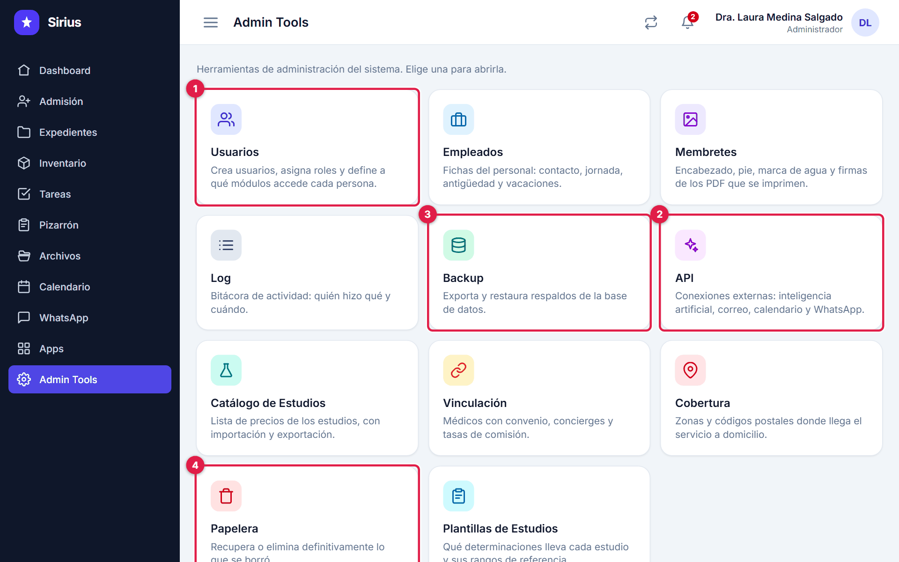
*1 Usuarios · 2 API · 3 Backup · 4 Papelera. Cada tarjeta explica en una línea para qué sirve la herramienta.*

| Herramienta | Para qué sirve | Apartado |
|---|---|---|
| **Usuarios** | Crear personas, roles y permisos | 3 |
| **Empleados** | Ficha, jornada y vacaciones del personal | 4 |
| **Membretes** | Encabezado, pie, marca de agua y firmas de los PDF | 6 |
| **Log** | Quién hizo qué y cuándo | 14 |
| **Backup** | Respaldar y restaurar la base | 12 |
| **API** | IA, correo, calendario y WhatsApp | 5 |
| **Catálogo de Estudios** | Lista de precios | 7 |
| **Vinculación** | Médicos con convenio, concierges y comisiones | 9 |
| **Cobertura** | Zonas a domicilio | 10 |
| **Papelera** | Recuperar lo eliminado | 13 |
| **Plantillas de Estudios** | Determinaciones y rangos de referencia | 8 |

Mientras estás dentro de una herramienta, **«Admin Tools» sigue resaltado** en el menú; pulsa ahí para volver al panel. Un usuario estándar al que le des algunas herramientas verá **solo esas tarjetas**.

---

## 3. Usuarios y permisos

### 3.1 La lista de usuarios

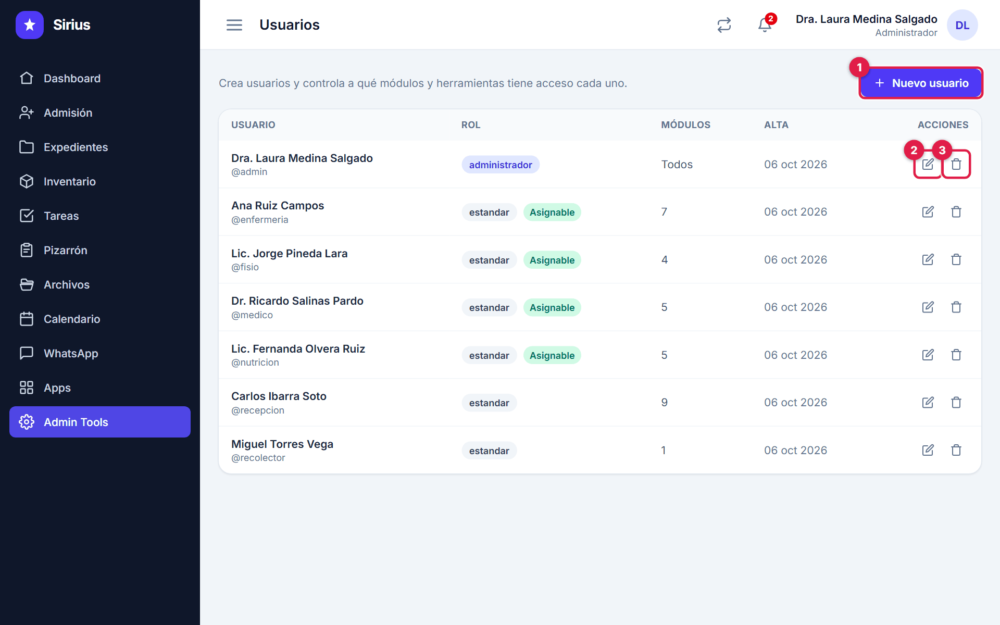
*1 Nuevo usuario · 2 Editar · 3 Eliminar.*

Cada fila muestra el nombre, el usuario (`@usuario`), el rol, si es **Asignable**, cuántos módulos tiene y la fecha de alta. Un usuario **inactivo** aparece atenuado.

### 3.2 Crear un usuario

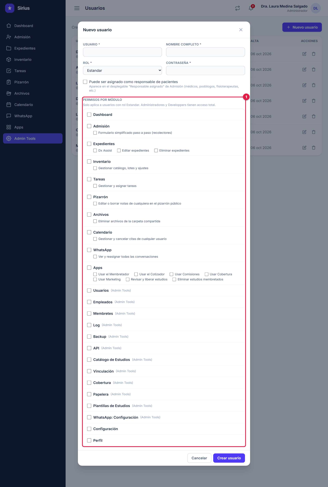
*1 Matriz de permisos por módulo.*

1. **Nuevo usuario.**
2. **Usuario** (para iniciar sesión; **no se puede cambiar después**), **Nombre completo**, **Rol** y **Contraseña** (mínimo **6 caracteres**).
3. **«Puede ser asignado como responsable de pacientes»:** actívalo para médicos, nutriólogos, fisioterapeutas, podólogos, etc. Aparecerán en el desplegable **Responsable asignado** de Admisión.
4. Si el rol es **Estándar**, marca en la **matriz** (1) los módulos y privilegios (siguiente apartado).
5. **Guardar.**

> **Contraseñas.** Dale a cada persona una contraseña **distinta y propia**; pídele que la conserve y no la comparta. Para restablecerla, edita al usuario y escribe una **contraseña nueva** (si dejas el campo vacío, la actual **no cambia**).

### 3.3 La matriz de permisos

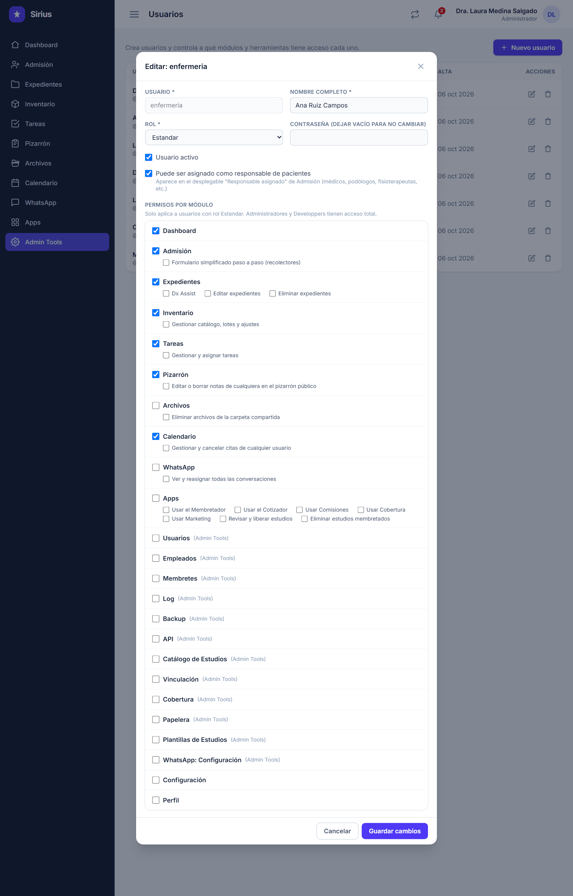

La matriz tiene **una fila por módulo**. Una casilla da acceso al módulo; las casillas más pequeñas debajo son **privilegios**, que dan capacidades extra **dentro** de ese módulo. Solo aplica a usuarios **Estándar**: administradores y developpers tienen todo.

| Módulo | Privilegios | Qué cambia |
|---|---|---|
| Dashboard | — | Pantalla de inicio. |
| **Admisión** | *Formulario simplificado paso a paso (recolectores)* | El usuario **solo** ve el modo asistido (su interfaz entera). **No lo hereda ningún administrador**: lo encerraría en el asistente. |
| **Expedientes** | *Dx Assist* · *Editar expedientes* · *Eliminar expedientes* | Apoyo diagnóstico con IA; corregir datos de pacientes y admisiones; dar de baja pacientes. |
| **Inventario** | *Gestionar catálogo, lotes y ajustes* | Sin él, solo registra entradas y salidas. |
| **Tareas** | *Gestionar y asignar tareas* | Ver y asignar tareas de todos; crear y editar proyectos. |
| **Pizarrón** | *Editar o borrar notas de cualquiera en el pizarrón público* | Sin él, cada quien edita solo lo suyo. |
| **Archivos** | *Eliminar archivos de la carpeta compartida* | Incluso los que subió otra persona. |
| **Calendario** | *Gestionar y cancelar citas de cualquier usuario* | Sin él, ve solo las suyas y las generales. |
| **WhatsApp** | *Ver y reasignar todas las conversaciones* | Sin él, ve solo las asignadas a él o sin responsable. |
| **Apps** | *Membretador*, *Cotizador*, *Comisiones*, *Cobertura*, *Marketing*, *Revisar y liberar estudios*, *Eliminar estudios membretados* | Cada sub-herramienta se habilita por separado. |
| **Usuarios, Empleados, Membretes, Log, Backup, API, Catálogo, Vinculación, Cobertura, Papelera, Plantillas** | — | Herramientas de **Admin Tools**. Dalas con cuidado (ver el recuadro siguiente). |

**Siempre disponibles para todos**, sin que las marques: **Configuración** y **Perfil**.

> **Admin Tools para usuarios estándar.** Darle una herramienta a un usuario estándar solo hace que **vea esa tarjeta**. Las que manejan datos de todo el personal o de toda la base (Empleados, Backup, Papelera, API/Correo) **comprueban además que sea administrador**, así que no funcionarán aunque se las des. Usuarios, Log, Catálogo, Vinculación, Cobertura, Membretes y Plantillas sí operan con el permiso del módulo: **concédelas solo a personas de total confianza**.

**Perfiles típicos que puedes copiar:**

| Puesto | Módulos | Privilegios |
|---|---|---|
| Recepción | Dashboard, Admisión, Expedientes, Tareas, Pizarrón, Archivos, Calendario, WhatsApp, Apps | Expedientes: *Editar* · Apps: *Cotizador*, *Cobertura* |
| Recolector a domicilio | Admisión | *Formulario simplificado* |
| Enfermería | Dashboard, Admisión, Expedientes, Inventario, Tareas, Pizarrón, Calendario | — |
| Médico / especialista | Dashboard, Expedientes, Calendario, Tareas, Pizarrón | Expedientes: *Dx Assist*, *Editar* · y márcalo **Asignable** |

### 3.4 Quién ve qué expediente: el «Responsable asignado»

Al hacer una admisión se elige un **Responsable asignado**. **Solo esa persona y los administradores** ven ese expediente; si queda en **«General»**, lo ve cualquier usuario con acceso a Expedientes. Esto aplica también al crear citas, resultados y otras cosas ligadas al paciente. Si alguien dice «no veo a mi paciente», **empieza por revisar a quién se asignó**.

### 3.5 Desactivar, editar y eliminar

- **Desactivar** (casilla *Usuario activo* al editar) impide que entre, **sin perder su historial**. Es lo **recomendable** cuando alguien deja la clínica.
- **Eliminar** borra al usuario y **sus fichas de empleado y de vacaciones**. Úsalo solo para cuentas creadas por error. Lo que esa persona hizo en la bitácora queda registrado con su nombre.
- El **usuario** (nombre de acceso) no se puede cambiar. Si hace falta otro, crea uno nuevo y desactiva el anterior.

---

## 4. Empleados: ficha, jornada y vacaciones

Aquí llevas el control del personal. Cada empleado ve **solo lo que tú decidas** en su **Perfil** (menú de su nombre).

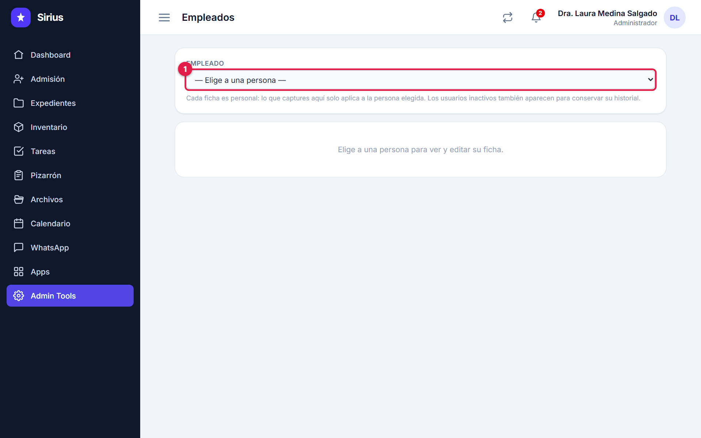
*1 Desplegable con todos los usuarios de Sirius. Los inactivos también aparecen, para conservar su historial; «sin ficha» indica a quién aún no le has capturado nada.*

### 4.1 La ficha

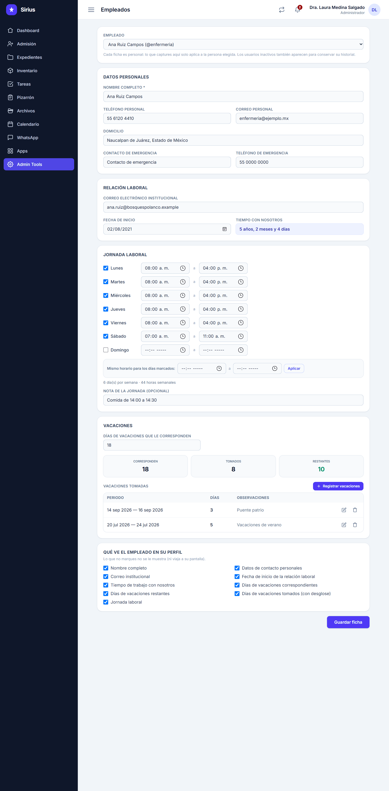

Elige a una persona y se abre su ficha, en secciones:

1. **Datos personales:** nombre completo (se corrige también en su usuario), teléfono, correo personal, domicilio y contacto de emergencia.
2. **Relación laboral:** **correo institucional** y **fecha de inicio**. Con la fecha, Sirius calcula **solo** el **tiempo con la clínica** («5 años, 2 meses y 4 días»); nunca se captura a mano.
3. **Jornada laboral:** marca los **días** que trabaja y la **hora de entrada y salida** de cada uno. Hay un atajo, **«Mismo horario para los días marcados»**, para escribirlo una sola vez. Sirius te dice los días por semana y las **horas semanales**, y admite una **nota** (por ejemplo, el horario de comida).
4. **Vacaciones** (siguiente apartado).
5. **Qué ve el empleado en su Perfil:** una casilla por cada dato (nombre, contacto, correo institucional, fecha de inicio, tiempo con nosotros, días correspondientes, restantes, tomados con desglose y jornada). **Lo que no marques no se le muestra ni viaja a su pantalla.**

Pulsa **Guardar ficha**. Si cambias de persona con cambios sin guardar, Sirius te avisa.

### 4.2 Vacaciones

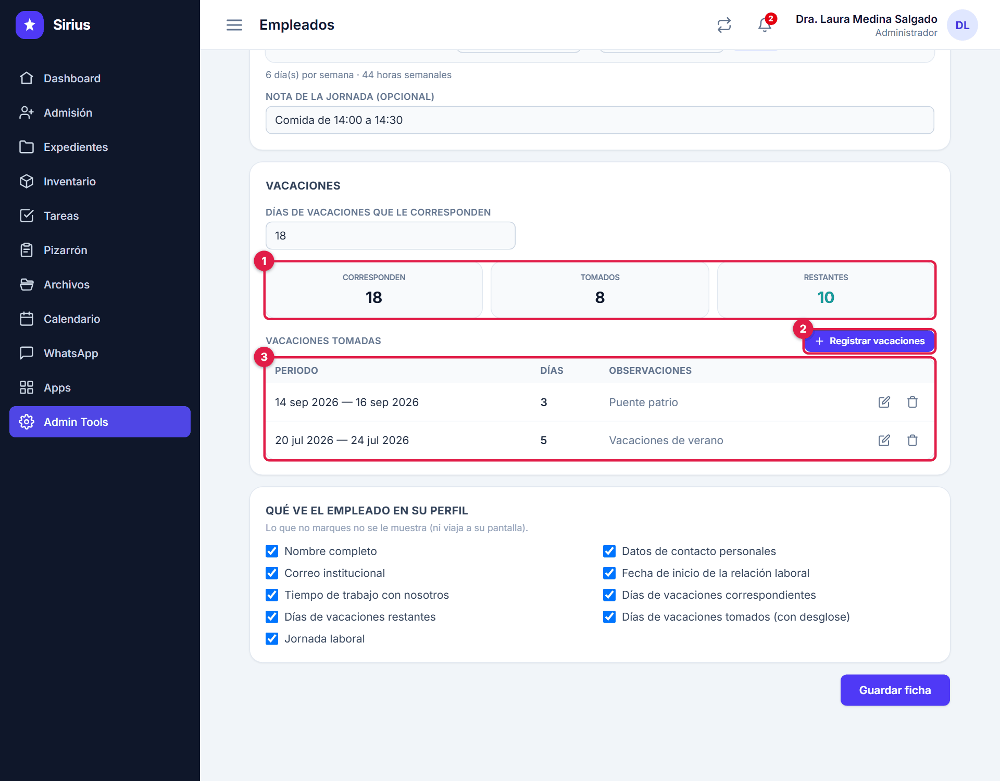
*1 Resumen: corresponden, tomados y restantes · 2 Registrar vacaciones · 3 Vacaciones tomadas, con editar y eliminar.*

- **Días que le corresponden:** un **número** que tú capturas (por ejemplo, 12 o 18). No hay tabla automática por antigüedad: lo decides tú cada año.
- **Tomados** y **restantes** **se calculan solos** a partir de los registros. Si alguien se pasa de su cupo, el resumen dice **«Excedidos»** en rojo.

**Registrar vacaciones:**

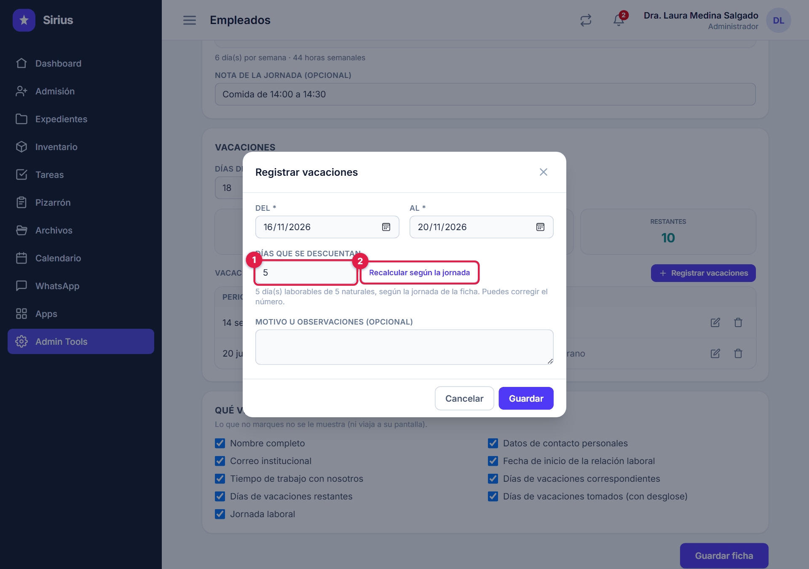
*1 Días que se descuentan (se calculan solos; puedes corregirlos) · 2 «Recalcular según la jornada».*

1. **Registrar vacaciones.**
2. Elige **Del** y **Al** (ambos días incluidos).
3. Sirius calcula los **días que se descuentan contando solo los días en que el empleado trabaja según su jornada**: un fin de semana que cae dentro del rango **no gasta vacaciones**. Puedes **corregir el número** (por ejemplo, por un día festivo).
4. Escribe los **motivos u observaciones** (opcional) y guarda.

**Reglas que debes conocer:**

- El cálculo usa **la jornada que ves en pantalla**, aunque no la hayas guardado todavía. Aun así, **guarda la ficha** para conservarla.
- Si el empleado **no tiene ningún día marcado** en su jornada, se cuentan **todos los días naturales** y la pantalla te lo avisa.
- Las fechas **no pueden traslaparse** con otro registro del mismo empleado (los mismos días se descontarían dos veces).
- **Un registro ya guardado no se recalcula solo** si después cambias la jornada. Para corregirlo, ábrelo con el lápiz, pulsa **«Recalcular según la jornada»** y guarda.
- Un rango que cae **solo en días no laborables** da cero días y Sirius pide capturar el número a mano.

> Los datos de esta herramienta son **personales de cada trabajador**. Trátalos con confidencialidad.

---

## 5. Conexiones externas (API)

**Admin Tools → API** reúne las conexiones con servicios externos.

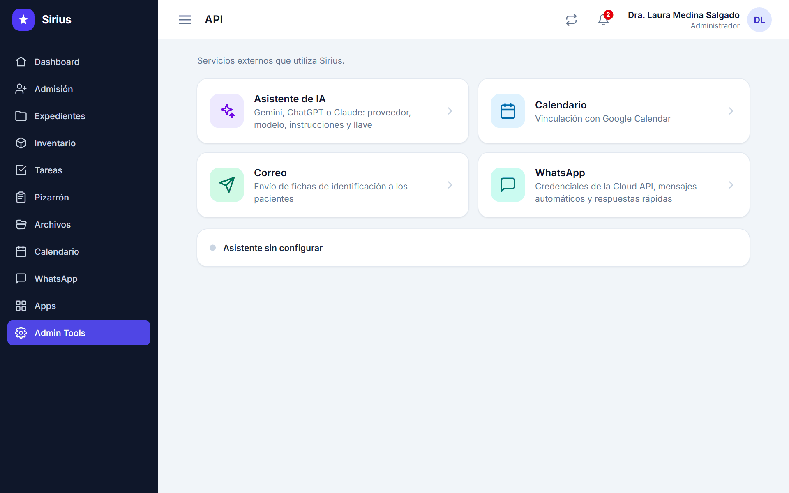

> **Las claves y contraseñas se guardan en el servidor y nunca vuelven al navegador.** Al reabrir una pantalla de estas, los campos secretos aparecen vacíos: **déjalos así para conservar la clave actual**, o escribe una nueva para sustituirla.

### 5.1 Asistente de IA

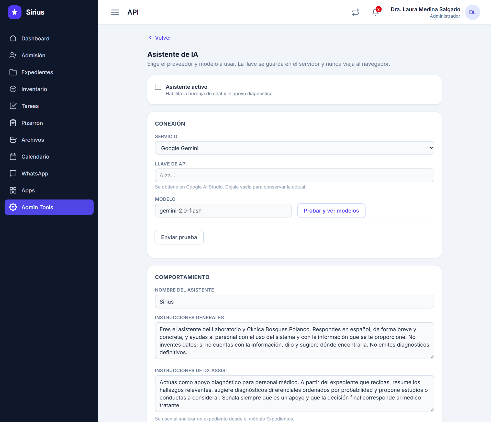

Activa la **burbuja del asistente** del menú y el **Dx Assist** de Expedientes.

1. Marca **Asistente activo**.
2. Elige el **servicio**: **Google Gemini**, **ChatGPT** o **Claude**.
3. Pega la **llave de API** que obtuviste en el sitio de ese proveedor (en Gemini, en *Google AI Studio*).
4. Escribe el **modelo** o pulsa **«Probar y ver modelos»** para que Sirius pruebe la llave y liste los disponibles.
5. **Enviar prueba** comprueba que todo responde.
6. En **Comportamiento** pones el **nombre** del asistente y dos textos de **instrucciones**: las generales (cómo debe responder el asistente) y las del **Dx Assist** (cómo analizar un expediente). Ya traen un texto prudente; ajústalos con cuidado.

> **Costo y privacidad.** El uso de la IA lo cobra el proveedor que elijas, según su tarifa. Lo que se escribe en el asistente y el expediente que analiza Dx Assist **se envía al proveedor**. Habilítalo solo si tu política de datos lo permite, e indica al personal que **no escriba datos personales innecesarios**.

### 5.2 Correo saliente

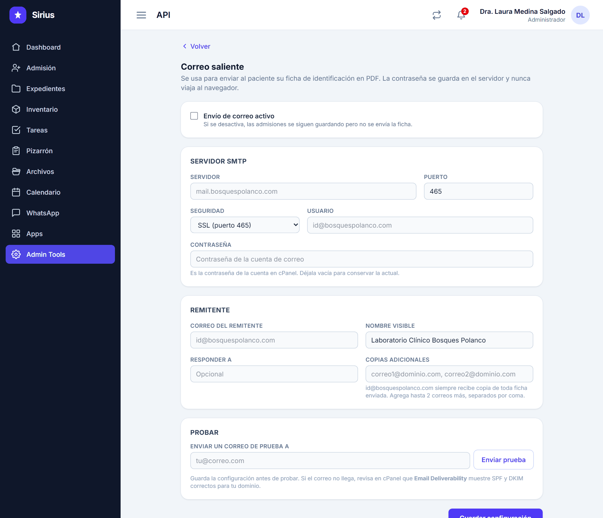

Sirve para **enviar al paciente su ficha de identificación en PDF** al registrar la admisión (y para el botón **Reenviar ficha**).

Datos que pide (los de un buzón de correo creado en tu hosting):

| Campo | Qué poner |
|---|---|
| **Servidor** | El de tu buzón (por ejemplo `mail.tudominio.com`). |
| **Puerto** y **Seguridad** | `465` con **SSL** es lo habitual. |
| **Usuario** | La dirección completa del buzón. |
| **Contraseña** | La del buzón. |
| **Correo del remitente** y **Nombre visible** | Lo que verá el paciente. |
| **Responder a** | Opcional. |
| **Copias adicionales** | **Una copia interna de cada ficha enviada**: el correo del remitente siempre la recibe y puedes agregar hasta dos más. |

Marca **Envío de correo activo** y usa el botón de **prueba** para enviarte un correo de verificación. Si el envío está desactivado o falla, **las admisiones se guardan igual**; solo no se manda la ficha.

### 5.3 Google Calendar

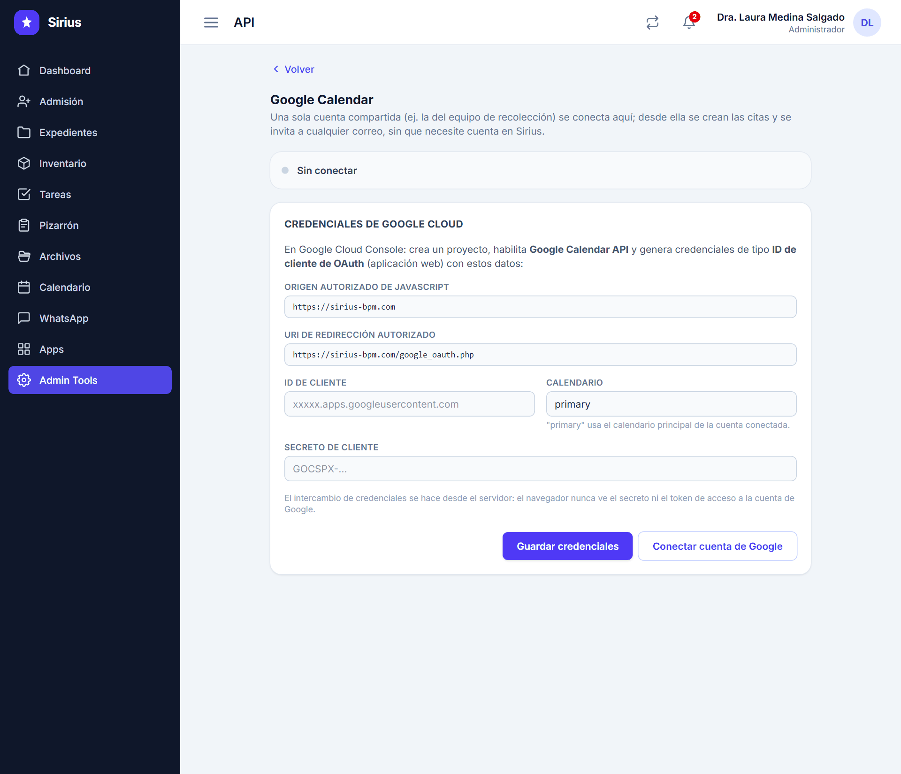

Sincroniza el calendario de Sirius con **una cuenta de Google compartida** (por ejemplo la del equipo de recolección). Las citas se crean en Google y los invitados externos reciben la invitación por correo sin necesitar cuenta en Sirius. **Sirius es la fuente de verdad**: si Google falla un momento, **la cita se guarda igual en Sirius**.

Pasos (una sola vez):

1. En **Google Cloud Console**, crea un proyecto y **habilita la API de Google Calendar**.
2. Crea una credencial **ID de cliente de OAuth, tipo «Aplicación web»**.
3. En ella pega, tal como los muestra la pantalla de Sirius: el **origen autorizado de JavaScript** y el **URI de redirección autorizado** (termina en `/google_oauth.php`).
4. Copia el **ID de cliente** y el **Secreto de cliente** a Sirius y deja el **Calendario** en `primary` (el calendario principal de la cuenta conectada).
5. **Guardar credenciales** y luego **Conectar cuenta de Google**; inicia sesión con la cuenta compartida y acepta el permiso.
6. Para terminar, la pantalla pasa a **Conectado** y muestra la cuenta. **Desconectar** quita la vinculación.

> **Si Google te manda de vuelta a una página que dice «Not Acceptable! … generated by Mod_Security».** Es el firewall del hosting bloqueando el regreso de Google (la dirección de regreso lleva dos URLs en sus parámetros). No es un fallo de Sirius. Pide al hosting que **excluya esa regla solo para la ruta `/google_oauth.php`** (véase el apartado 21).

> **Pantalla de consentimiento en «Testing».** Si en Google Cloud la pantalla de consentimiento está en estado de *prueba*, Google **caduca la conexión cada 7 días** y habría que reconectar cada semana. Pásala a **«En producción»** para evitarlo.

Además, el **cron de sincronización entrante** (apartado 20.3) trae a Sirius los cambios hechos en Google.

### 5.4 WhatsApp

La tarjeta **WhatsApp** de esta pantalla lleva a **WhatsApp: Configuración** (apartado 11).

---

## 6. Membretes

Define la **identidad visual de todos los PDF** que emite el Membretador (estudios, documentos) y de los demás impresos.

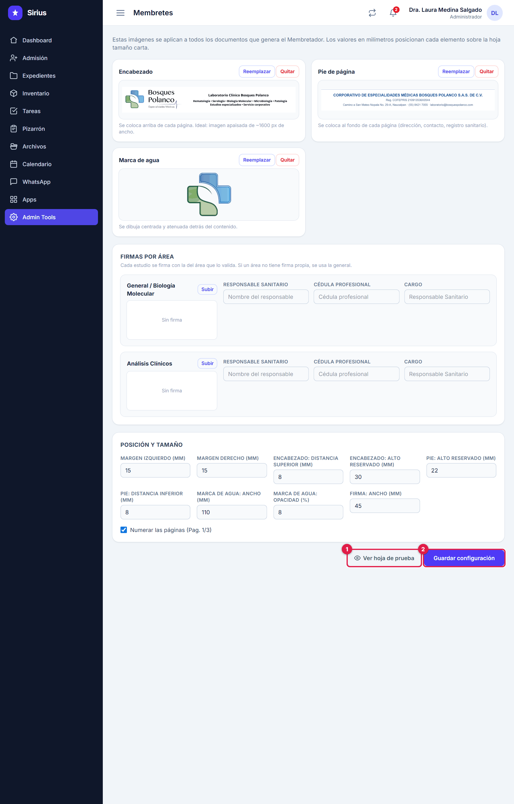
*1 Vista previa · 2 Guardar.*

- **Encabezado** y **Pie de página:** imágenes que se colocan arriba y abajo de cada hoja (ancho ideal ~1600 px). Cada una tiene **Reemplazar** y **Quitar**.
- **Marca de agua:** se dibuja centrada y atenuada detrás del contenido.
- **Firmas por área:** cada estudio se firma con la firma del **área que lo valida** (por ejemplo, General / Biología Molecular y Análisis clínicos). Para cada firma sube la **imagen** y captura el **responsable sanitario**, su **cédula profesional** y su **cargo**. Si un área no tiene firma propia, usa la general.
- **Medidas en milímetros** (márgenes, altura reservada del encabezado y del pie, opacidad de la marca de agua, ancho de la firma) y la opción de **numerar las páginas**.

Pulsa **Vista previa** para ver cómo quedará un PDF y **Guardar** para aplicar. **Los cambios afectan a todos los documentos nuevos.**

> Los datos del responsable sanitario son los que **aparecerán impresos** en los estudios que emitas. Captúralos con exactitud.

---

## 7. Catálogo de Estudios

Es la **lista de precios públicos** que usa el Cotizador y de donde se eligen los estudios en la admisión.

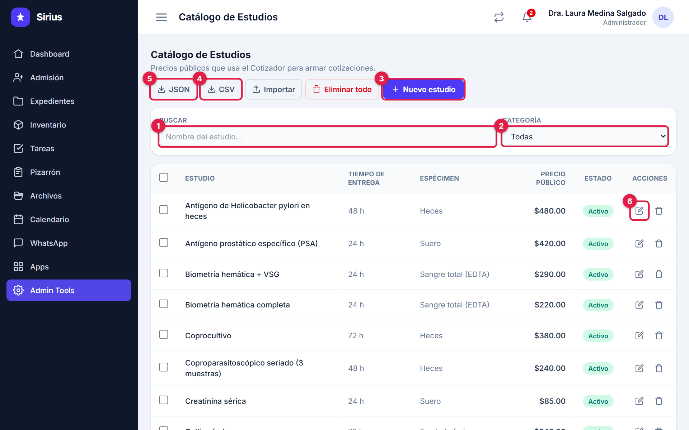
*1 Buscar · 2 Categoría · 3 Nuevo estudio · 4 Exportar CSV · 5 Exportar JSON · 6 Editar un estudio.*

### 7.1 Alta y edición

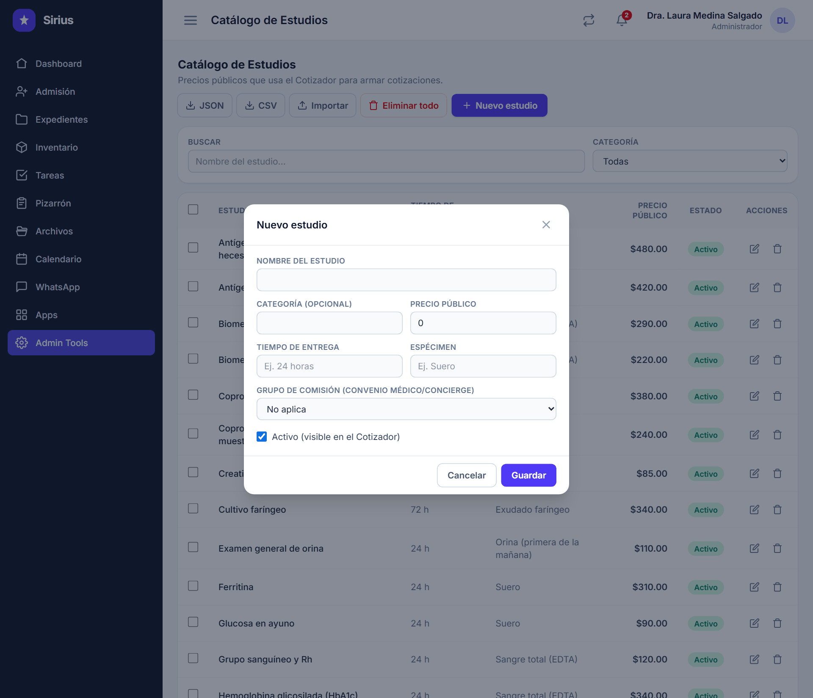

Cada estudio tiene: **nombre**, **categoría** (opcional), **precio público**, **tiempo de entrega** (por ejemplo «24 h»), **espécimen** (por ejemplo «Suero»), el **grupo de comisión** (**Biología molecular** o **Análisis clínicos**, para calcular comisiones de médicos con convenio; «No aplica» si no genera comisión) y si está **activo** (visible en el Cotizador).

Desactiva un estudio en lugar de borrarlo si solo quieres que deje de ofrecerse.

### 7.2 Exportar e importar

- **JSON** y **CSV** exportan **todo el catálogo**.
- **Importar** acepta un `.json` o `.csv`. Es un **proceso en dos pasos**:

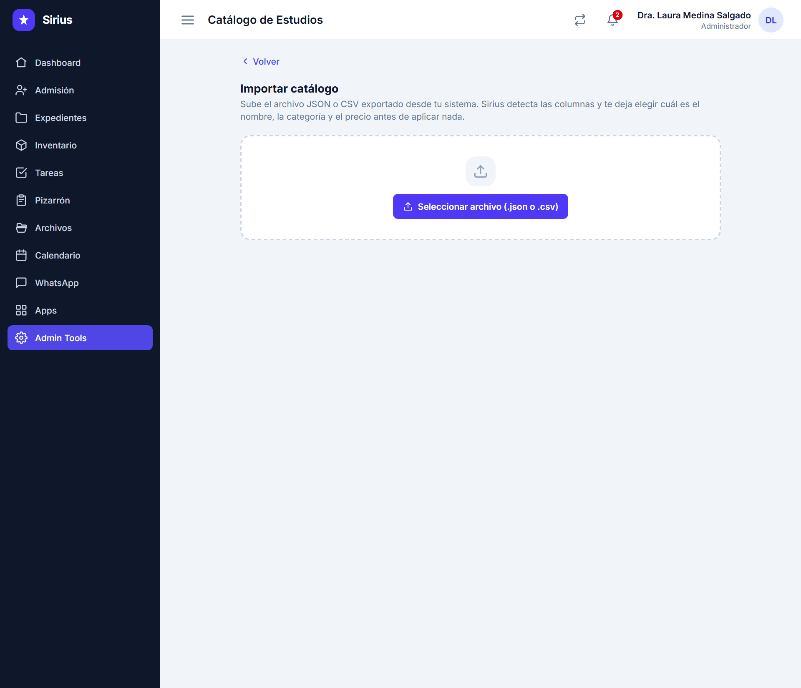

1. **Revisión.** Sirius **lee el archivo sin cambiar nada** y detecta sus columnas. Tú indicas **cuál columna es el nombre** (obligatoria) y, opcionalmente, categoría, precio, tiempo de entrega y espécimen.
2. **Aplicar**, en uno de dos modos:
   - **Agregar (recomendado):** agrega los estudios nuevos y actualiza los que ya existen **solo en las columnas que mapeaste**. Importar un archivo que solo trae precios **no borra** las categorías.
   - **Reemplazar:** **sustituye todo el catálogo** por el del archivo. Hay que escribir **REEMPLAZAR** para confirmarlo.

### 7.3 Borrado

Puedes **borrar estudios seleccionados** o **todo el catálogo**; este último exige escribir **ELIMINAR**. Descarga antes un **CSV** de respaldo.

> Las admisiones y cotizaciones ya hechas **conservan** el nombre, precio, tiempo de entrega y espécimen que tenían: cambiar el catálogo no las altera.

---

## 8. Plantillas de Estudios

Definen **qué determinaciones lleva cada estudio de análisis clínicos y cuáles son sus valores de referencia**, para emitir resultados en el Membretador.

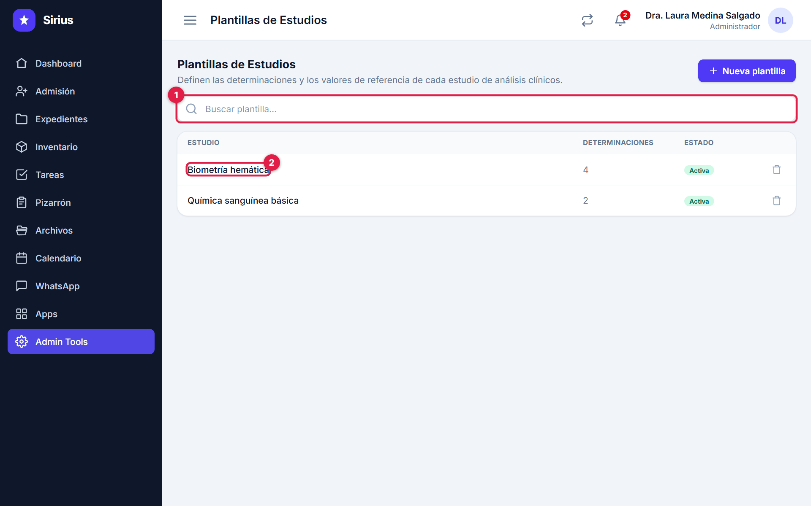

- Una **plantilla** es un estudio (por ejemplo «Biometría hemática») con una **lista ordenada de determinaciones** (hemoglobina, hematocrito, leucocitos, plaquetas…).
- Cada **determinación** guarda su **unidad**, su **técnica** y sus **rangos de referencia**, que pueden depender del **sexo**, de la **edad** y de una **condición** (por ejemplo «ayuno»). Los rangos se capturan **una sola vez** y las plantillas solo los **apuntan**: así una determinación nunca queda con dos intervalos contradictorios.

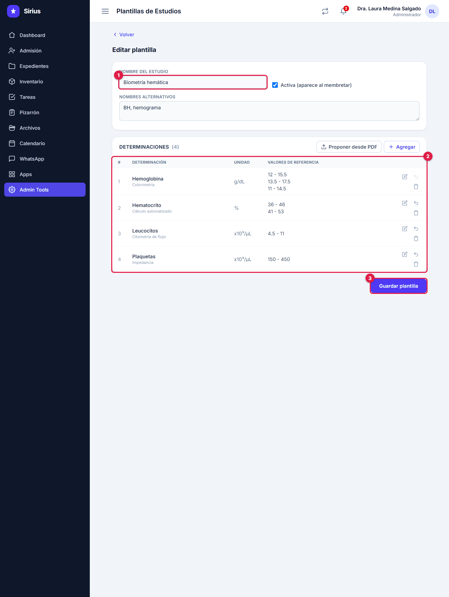

Puedes **crear la plantilla a mano** agregando determinaciones, o dejar que la **IA proponga una plantilla a partir de un PDF** de un estudio (requiere el asistente de IA activo) y tú la revisas antes de guardar.

> **Revisa siempre los rangos.** Cualquier cambio afecta a los resultados nuevos. Un error en un rango puede marcar como «normal» un valor que no lo es.

---

## 9. Vinculación y comisiones

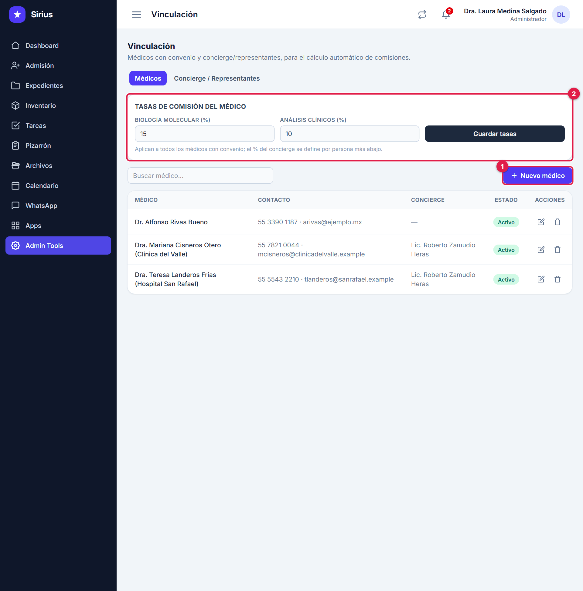
*1 Nuevo médico · 2 Tasas de comisión.*

Aquí registras a los **médicos con convenio** y a los **concierges (representantes)** que los atienden.

- **Médicos:** nombre, teléfono, correo, **código de vinculación** (opcional) y el **concierge** que tiene asignado. Estos médicos aparecen en el desplegable **Médico tratante** de la admisión de laboratorio. Desactivar a un médico lo quita de la lista sin perder su historial.
- **Concierge / Representantes:** nombre, contacto y **su porcentaje propio de comisión**.
- **Tasas de comisión:** dos porcentajes globales para **los médicos**: **Biología molecular (%)** y **Análisis clínicos (%)**. La tasa que aplica a cada estudio depende de su **grupo de comisión** en el catálogo. Pulsa **Guardar tasas** para aplicarlas.

Con estos datos, **Apps → Comisiones** calcula el **estado de cuenta** de cada médico (y de cada concierge, sobre el mismo monto) por periodo; se puede revisar línea por línea, excluir líneas y descargar el PDF. Consulta el Manual de usuario estándar, apartado 14.3.

**Estado de cuenta en PDF:**

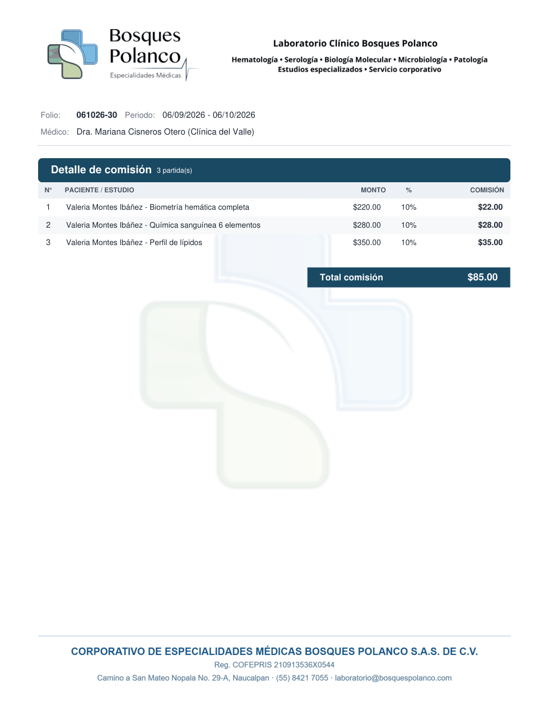

---

## 10. Cobertura

Define **dónde llega la unidad móvil**. El personal consulta por **código postal** (Apps → Cobertura); tú administras la información aquí.

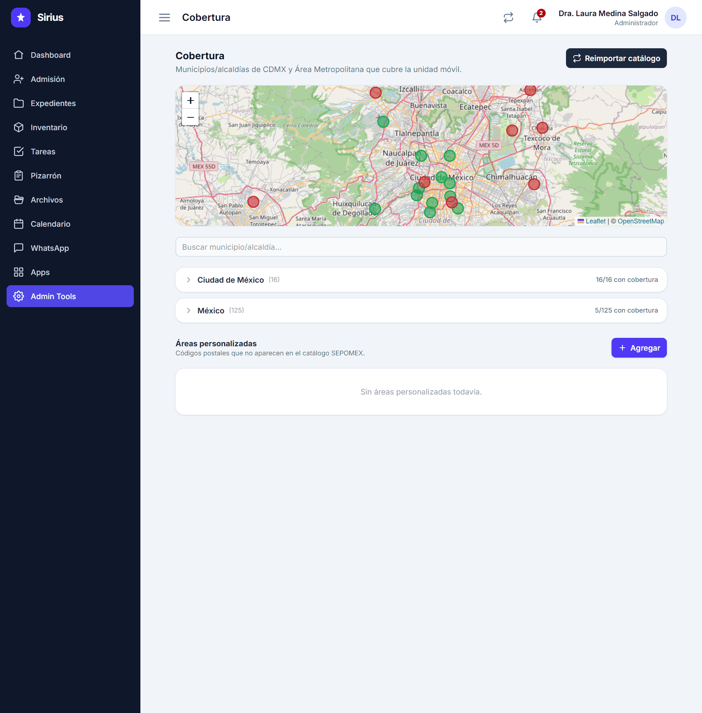

- El **mapa** muestra los municipios y alcaldías: en **verde** los que tienen cobertura y en **rojo** los que no.
- Debajo hay una lista por **estado** y **municipio**. Despliega uno para ver sus **códigos postales** y colonias. Puedes:
  - **activar o desactivar la cobertura completa** de un municipio con un clic;
  - marcar **«costo extra»** (zona que se atiende con recargo, por ejemplo por distancia);
  - **sobrescribir** un código postal concreto aunque su municipio tenga o no cobertura.
- **Áreas personalizadas:** agrega códigos postales que **no aparecen en el catálogo oficial** (SEPOMEX).
- **Reimportar catálogo:** vuelve a cargar el catálogo oficial de zonas y códigos postales. **Úsalo con cuidado.**

---

## 11. WhatsApp: configuración

Para recibir y responder WhatsApp dentro de Sirius se usa la **WhatsApp Cloud API de Meta**.

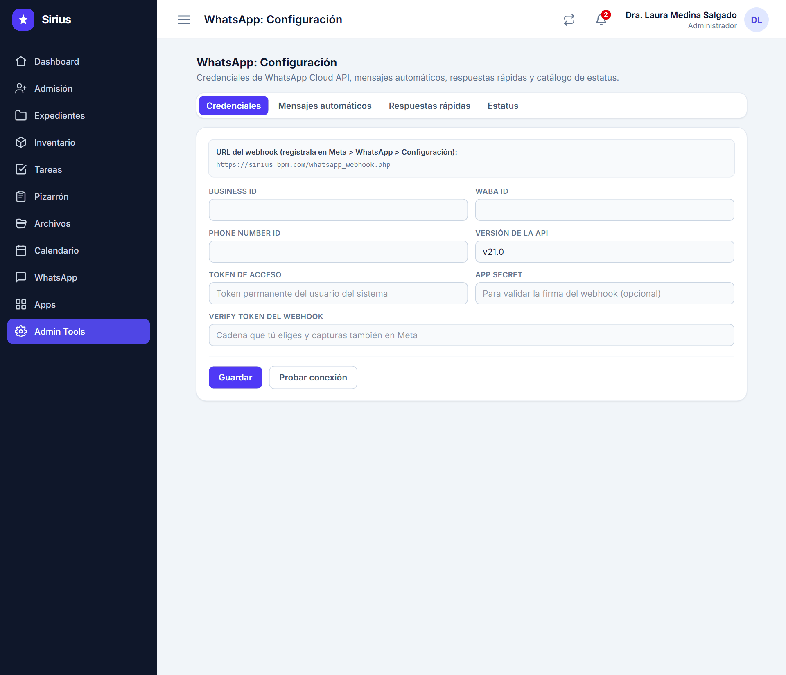

La pantalla tiene cuatro pestañas:

1. **Credenciales:** *Business ID*, *WABA ID*, *Phone Number ID*, versión de la API, **token de acceso** (permanente, del usuario del sistema), *App Secret* (para validar la firma del webhook; opcional) y el **Verify Token** (una cadena que tú inventas y también capturas en Meta). Arriba verás la **URL del webhook** que debes registrar en Meta (termina en `/whatsapp_webhook.php`). El botón **Probar conexión** valida las credenciales.
2. **Mensajes automáticos:** un mensaje de **bienvenida** y uno de **ausencia** (fuera de horario), con **horario por día de la semana**.
3. **Respuestas rápidas:** textos frecuentes que el personal inserta con un clic.
4. **Estatus:** el catálogo de estatus de las conversaciones (por ejemplo, «Pendiente de responder», «Cita realizada», «Resultados enviados») con su color y orden.

**Reglas de WhatsApp que debes conocer:**

- Solo se puede **responder con texto libre dentro de las 24 horas siguientes** al último mensaje del cliente. Después, solo plantillas aprobadas por Meta, que se envían desde **Meta Business Manager**.
- La **configuración de las credenciales con Meta** (crear la app, el número, el token) se hace en el sitio de Meta; Sirius solo las guarda.

---

## 12. Backup: respaldar y restaurar

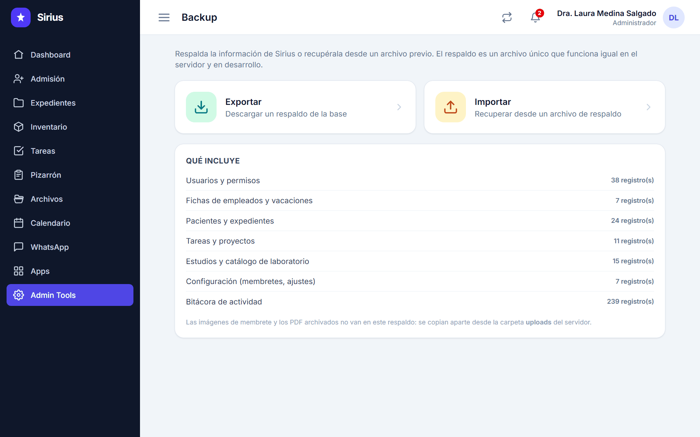

**Backup** guarda toda la información de Sirius en **un solo archivo** y permite recuperarla. Funciona igual en el servidor y en desarrollo.

### 12.1 Qué incluye

El respaldo se arma por **grupos**, con su número de registros: **Usuarios y permisos**, **Fichas de empleados y vacaciones**, **Pacientes y expedientes**, **Tareas y proyectos**, **Estudios y catálogo de laboratorio**, **Configuración** y **Bitácora de actividad**.

> **Lo que NO incluye.** Las **imágenes de membrete** y los **archivos subidos** (documentos de pacientes, archivos del gestor, imágenes del pizarrón) **no van en el respaldo**: se copian aparte, desde la carpeta `uploads` del servidor (por ejemplo, con el *Administrador de archivos* del hosting).

> **El archivo es muy delicado.** Contiene **datos de pacientes** y de personal, **contraseñas cifradas** de los usuarios y la **configuración con las llaves** del asistente de IA, correo, WhatsApp y Google. **Guárdalo en un lugar seguro, no lo envíes por chat ni correo sin cifrar y bórralo cuando ya no lo necesites.**

### 12.2 Exportar

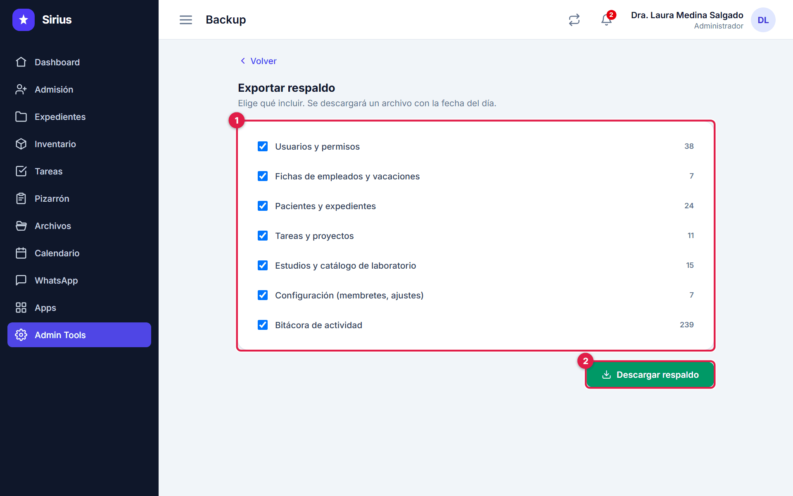
*1 Grupos a incluir · 2 Descargar respaldo.*

1. **Backup → Exportar.**
2. Deja marcados los grupos que quieras (normalmente **todos**).
3. **Descargar respaldo.** El archivo lleva la fecha del día.

**Cuándo:** al menos **una vez por semana** y **siempre antes de** importar, restaurar, borrar el catálogo o hacer cambios grandes. Sirius incluso programa una **tarea recurrente semanal** «Respaldo semanal de la base de datos» si la dejas creada en Tareas.

### 12.3 Importar (restaurar)

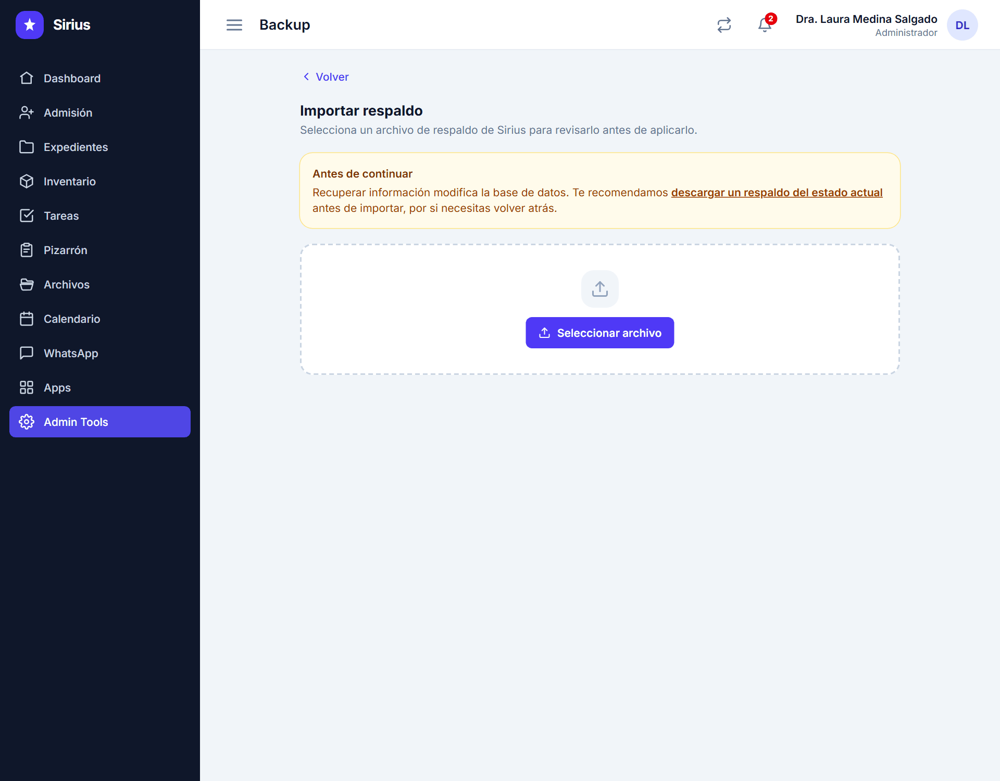

1. **Backup → Importar** y **Seleccionar archivo**.
2. Sirius **revisa el archivo sin aplicar nada** y te muestra qué contiene (fecha, motor, grupos y número de registros por tabla).
3. Elige el modo:
   - **Agregar:** solo inserta los registros **que no existan** (por su número interno). No pisa nada.
   - **Reemplazar:** **vacía las tablas incluidas** y las llena con las del archivo. Hay que escribir **REEMPLAZAR** para confirmarlo.
4. **Restaurar.** Todo ocurre en **una sola operación**: si algo falla, **la base queda como estaba**.

> **Antes de restaurar, descarga un respaldo del estado actual**, por si necesitas volver atrás.

---

## 13. Papelera

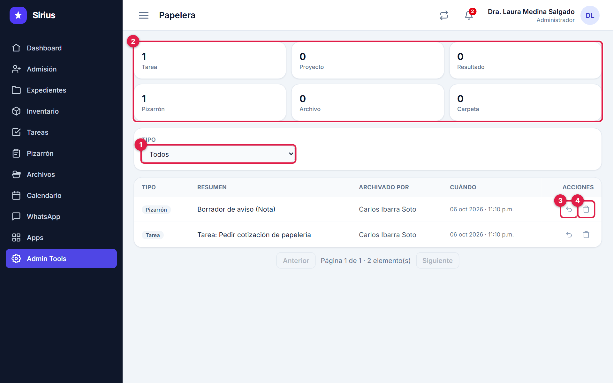
*1 Filtro por tipo · 2 Conteos por tipo · 3 Restaurar · 4 Eliminar en definitiva.*

La papelera guarda lo que se eliminó, para que **puedas recuperarlo**. Solo la ve y maneja un administrador.

- **Qué llega a la papelera:** **tareas y proyectos** (siempre), **archivos y carpetas** (siempre) y los **resultados por entregar** y **notas del pizarrón** que borra una persona **sin privilegio de gestión**. Si borra alguien con ese privilegio (o un administrador), esas dos últimas cosas **se eliminan en definitiva**.
- Cada fila dice el **tipo**, un **resumen**, **quién** lo archivó y **cuándo**.
- **Restaurar** devuelve el elemento a su lugar con el mismo contenido (un proyecto regresa con sus tareas).
- **Eliminar en definitiva** lo borra para siempre y **no se puede deshacer**.

---

## 14. Log: la bitácora de actividad

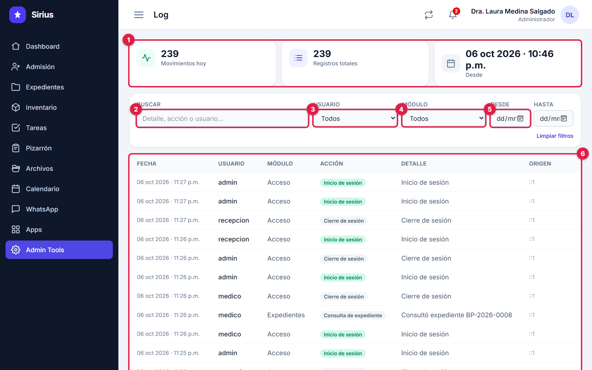
*1 Resumen: movimientos de hoy y totales · 2 Buscar · 3 Usuario · 4 Módulo · 5 Fechas · 6 Registros.*

Sirius **anota cada acción relevante**: quién entró, quién creó o editó un usuario, una admisión, un estudio, quién descargó un expediente, quién exportó un PDF, quién cambió permisos, etc. Cada línea tiene **fecha y hora, usuario, módulo, acción, detalle y origen** (dirección de red).

- Filtra por **texto**, **usuario**, **módulo** y **rango de fechas**; **Limpiar filtros** vuelve a todo.
- Las acciones se muestran con una **etiqueta de color** (verde: acceso; rojo: bajas o intentos fallidos; ámbar: cambios).
- Es **solo de lectura**: nadie puede editar ni borrar la bitácora desde la aplicación.

**Para qué usarla:** investigar quién cambió algo, detectar **intentos fallidos de acceso** repetidos y comprobar quién consultó o imprimió un expediente. Revísala cuando algo «aparezca raro».

---

## 15. Configuración de la aplicación

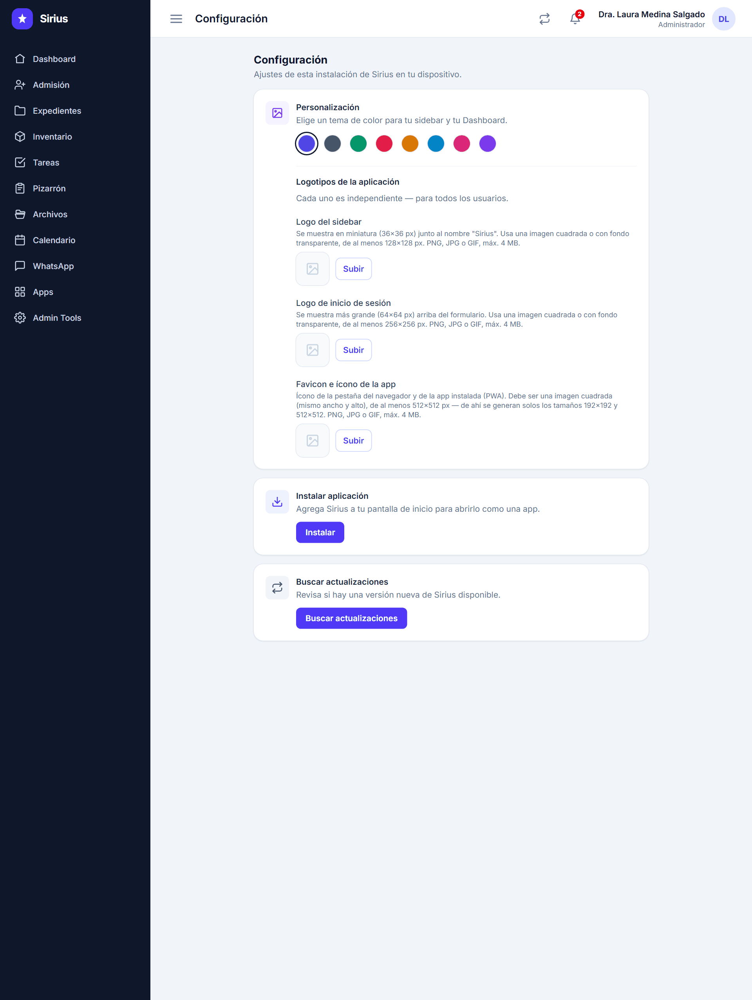

Además de lo que ve cualquier usuario (color de menú, instalar la app y buscar actualizaciones), el administrador ve **Logotipos de la aplicación**, cada uno **independiente** y **para todos los usuarios**:

- **Logo del sidebar:** miniatura (~36×36 px) junto al nombre «Sirius». Imagen cuadrada o con fondo transparente (PNG, JPG o GIF, máx. 4 MB).
- **Logo de inicio de sesión:** más grande (~64×64 px) arriba del formulario.
- **Favicon e icono de la app:** la pestaña del navegador y la app instalada (PWA). Imagen cuadrada de al menos 512×512 px; de ahí se generan los tamaños de 192 y 512.

Cada uno tiene **Subir** y, una vez subido, **Quitar** (vuelve al de Sirius).

---

## 16. Lo que cambia para el administrador en los demás módulos

Todo lo del Manual estándar aplica. Estas son las diferencias:

| Módulo | Qué más puedes hacer |
|---|---|
| **Admisión** | Ves el enlace **«Laboratorio en modo asistido»** para usar el formulario paso a paso. En Control de peso verás el **botón de la báscula** (apartado 17). |
| **Expedientes** | Ves **todos** los expedientes, sin importar el responsable; puedes **editar y eliminar** pacientes y **consolidar** consultas de Control de peso de cualquiera. |
| **Inventario** | **Nuevo artículo**, editar el catálogo, desactivar artículos, ajustar o borrar lotes. |
| **Tareas** | Ver y **asignar tareas de todos**, crear **proyectos**. |
| **Pizarrón** | Editar o borrar **notas ajenas** del pizarrón público. |
| **Archivos** | Eliminar archivos ajenos de la carpeta compartida. |
| **Calendario** | Ver y cancelar **las citas de todos**. |
| **WhatsApp** | Ver y **reasignar todas** las conversaciones. |
| **Apps** | Todas las sub-herramientas, incluidas **revisar y liberar estudios** y **eliminar estudios membretados**. |
| **Dashboard** | Aparecen las alertas de **estudios en borrador pendientes de revisión**. |

El **Membretador** merece una mención: los documentos pasan por **borrador → revisión → liberación**. El administrador (o quien tenga el privilegio de *revisar*) los libera.

---

## 17. Báscula Bluetooth (en preparación)

En la **admisión de Control de peso** y en la **consulta nueva**, el administrador ve el botón **Conectar báscula**. Sirve para tomar el **peso** y la **impedancia** directamente de una báscula de bioimpedancia por Bluetooth y llenar el formulario solo.

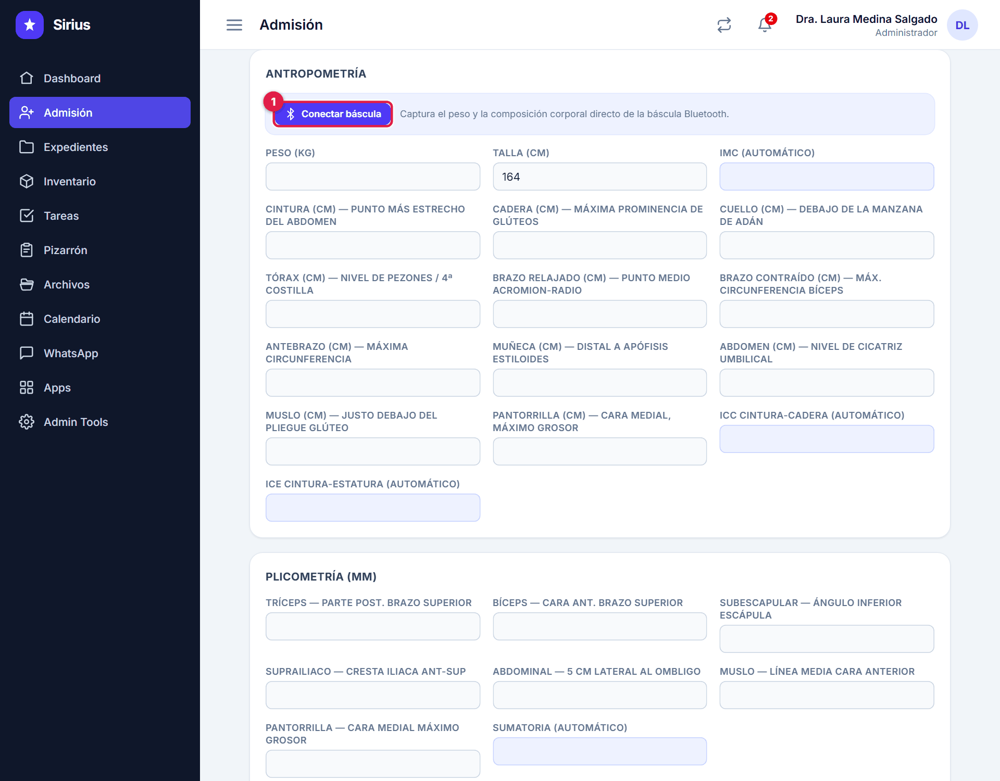
*1 Botón «Conectar báscula», en la sección de Antropometría.*

> **Estado actual: todavía no lee la báscula de la clínica.** Cada modelo de báscula manda sus datos de forma distinta y **Sirius aún no tiene el «decodificador» de la báscula de la clínica**. Hasta entonces el botón existe **solo para el administrador** y sirve para **sacar un informe técnico** que permita escribir ese decodificador. **No captures pacientes con esta función todavía.**
>
> Las capturas siguientes usan una **simulación** para mostrar cómo funcionará; **no son una lectura real**.

**Lo que ya está listo** (probado con una báscula simulada):

1. **Conectar báscula** abre un modal con las instrucciones: cierra la app de la báscula del teléfono, enciende el Bluetooth (y la ubicación en Android), despierta la báscula con el pie y pulsa **Buscar báscula**.

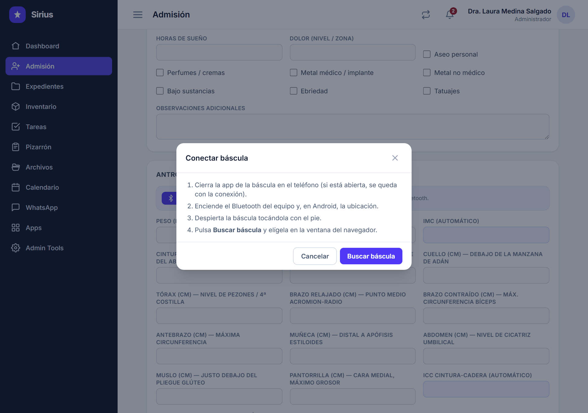

2. Al elegir la báscula, **el modal se cierra solo**, aparece el aviso **«Báscula conectada. El paciente ya puede subir a la báscula»** y un **banner** dentro del formulario muestra el estado.

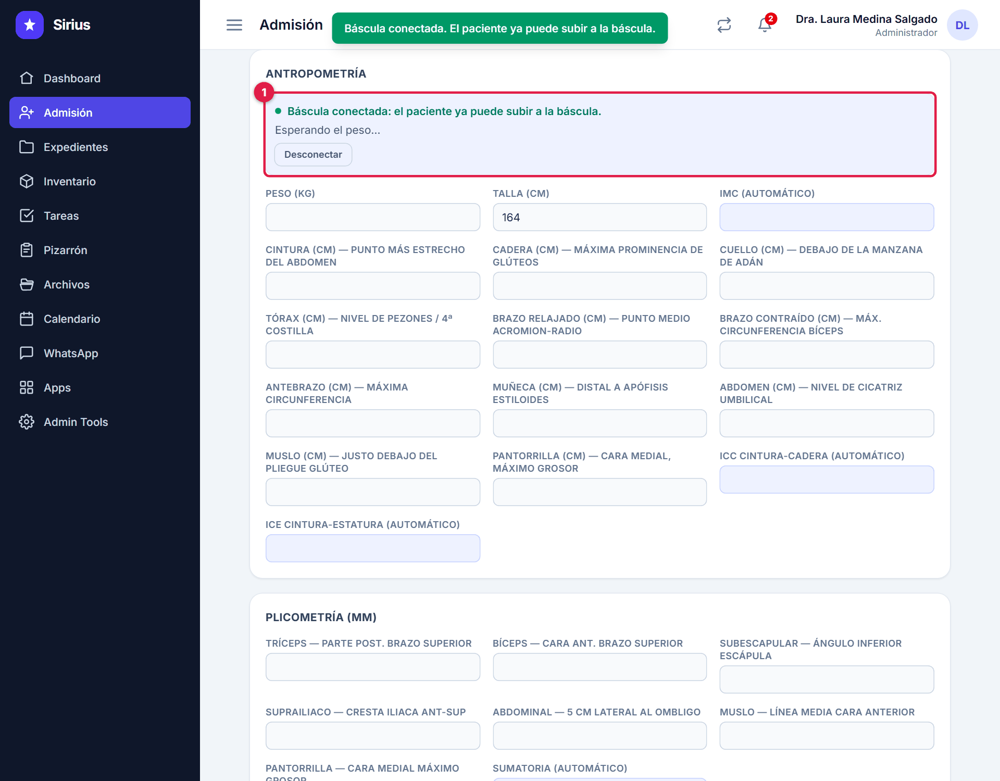

3. Cuando la lectura es **estable** (el mismo peso varias veces seguidas), se llenan los campos y el banner dice **«Capturado»**. **Nunca guarda el formulario por sí solo**: tú lo revisas y lo guardas.

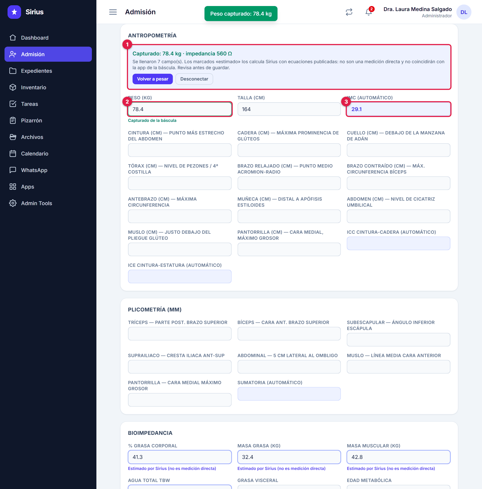
*1 Banner con el resultado · 2 Peso, etiquetado «Capturado de la báscula» · 3 IMC, calculado.*

4. Además del peso y la impedancia, Sirius **estima** grasa corporal, masa grasa, masa muscular, agua total y TMB con ecuaciones publicadas, y cada campo estimado lleva la etiqueta **«Estimado por Sirius (no es medición directa)»**.

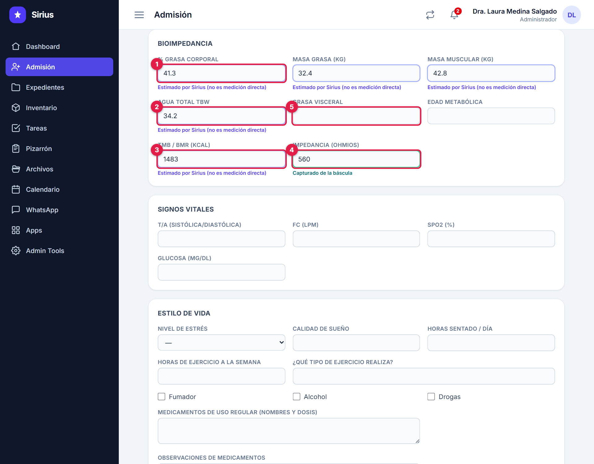

> **Los valores estimados NO coinciden con los de la app del fabricante** de la báscula (usa fórmulas propias y una báscula de pie a pie mide solo la parte baja del cuerpo). **Grasa visceral y edad metabólica no se estiman**: siguen capturándose a mano. No pisa lo que ya escribiste y, si editas un valor, pierde su etiqueta.

**Requisitos:** **Chrome o Edge** en **Windows o Android** y la página en **https**. **iPhone y iPad no pueden usar Bluetooth desde el navegador** (el botón sale desactivado con la razón).

**Cómo obtener el informe técnico** (para completar el soporte de tu báscula): abre `https://tu-dominio/bascula_prueba.php` como administrador, en Chrome o Edge de Android/Windows, con la app de la báscula **cerrada** y el Bluetooth encendido; pulsa buscar, elige la báscula, **pésate dos veces** esperando a que marque un peso fijo y pulsa **«Copiar informe»**. Entrega ese texto al desarrollador.

---

## 18. Rutina de administración

**A diario**
- Revisa el **Dashboard**: alertas de inventario, estudios por revisar, mensajes sin atender.
- Resuelve altas, bajas y cambios de permisos que pida el personal.

**Cada semana**
- **Exporta un respaldo** (Backup → Exportar) y guárdalo fuera del servidor, cifrado o en un lugar protegido.
- Revisa el **Log**: accesos fallidos, acciones inesperadas.
- Revisa la **Papelera** y **vacía lo que ya no sirve**.
- Comprueba que las **conexiones** siguen vivas (Calendario conectado, correo con prueba exitosa).

**Cada mes**
- Revisa **usuarios**: desactiva a quien ya no trabaje en la clínica y revisa los permisos de cada puesto.
- Actualiza **precios** del catálogo y **tasas de comisión** si cambiaron.
- Revisa que el **membrete** y los datos del **responsable sanitario** sigan vigentes.
- Verifica los **días de vacaciones** que corresponden a cada empleado.

**Cuando salga una versión nueva de Sirius**
- Recarga la app (**Configuración → Buscar actualizaciones**) y, si el desarrollador te lo indica, corre la **actualización de la base de datos** (apartado 20.2).

---

## 19. Seguridad y buenas prácticas

- **Cada persona, su usuario.** Nunca compartas contraseñas. Desactiva (no reutilices) cuentas de quien se va.
- **Mínimo privilegio.** Da solo los módulos y privilegios que el puesto necesita. Cuidado con **Usuarios**, **Backup**, **API** y **Papelera**.
- **Respaldos:** son el archivo más sensible del sistema (apartado 12.1). Guárdalos protegidos.
- **Llaves y contraseñas del servidor.** El archivo `includes/config.php` del servidor guarda los **datos de la base** y dos llaves: la **llave de instalación** y la **llave de cron**. **No las pegues en chats, correos ni documentos.** Si alguna vez se compartieron, **cámbialas** (contraseña de la base de datos desde cPanel y las llaves en `config.php`).
- **Equipos compartidos:** no marques «Recuérdame» y cierra sesión al terminar.
- **Imágenes compartidas del pizarrón** y **archivos** salen de Sirius: recuerda al personal que no incluyan datos de pacientes.
- **Notificaciones push:** el aviso no lleva datos clínicos; el contenido solo se muestra con sesión válida.
- **Actualizaciones del navegador:** pide al personal mantener Chrome/Edge/Safari actualizados.
- Los **expedientes** son datos personales sensibles de salud. El **aviso de privacidad** que se imprime es el texto predeterminado: **debe revisarlo el asesor legal de la clínica**, y se puede sustituir por el propio sin tocar código (ajuste `privacy_notice`).

---

## 20. Instalación, actualizaciones y tareas programadas

### 20.1 Primera instalación

En hosting con cPanel (HostGator): subir el sistema al sitio y abrir `https://tudominio.com/install/`, que es un **asistente visual**: te pide el nombre del negocio, los datos de la base MySQL (creada antes en cPanel) y el usuario y contraseña del administrador. Al terminar **muestra una sola vez dos llaves** (de instalación y de cron): **guárdalas**. Activa SSL (https) en el hosting.

### 20.2 Actualizaciones

Sirius se despliega **solo** cuando el desarrollador publica una versión: el servidor recibe los archivos nuevos y **la app de cada usuario toma la versión nueva** al usar **Buscar actualizaciones** (o al reabrirla; nunca se actualiza a media captura).

**Cuando una versión agrega tablas o columnas** a la base de datos, el administrador debe **correr la actualización de la base**, abriendo en el navegador:

`https://tudominio.com/install/setup.php?key=TU_LLAVE_DE_INSTALACION`

Es **segura de repetir**: solo agrega lo que falte, **no borra datos**. Termina con «Instalación/actualización completa» y la lista de tablas. **Sin este paso**, una función nueva que use una tabla nueva (por ejemplo, **Empleados**) mostrará «Error de base de datos». La llave está en `includes/config.php` del servidor (cPanel → Administrador de archivos).

### 20.3 Tareas programadas (cron)

Dos archivos están pensados para ejecutarse **solos**, desde **cPanel → Cron Jobs**:

| Archivo | Para qué | Frecuencia sugerida |
|---|---|---|
| `cron_push_reminders.php` | Manda **a cada usuario un solo aviso al día** con lo que le vence hoy (tareas, citas y resultados por entregar). | Una vez al día, temprano |
| `cron_calendar_sync.php` | Trae a Sirius los cambios hechos en **Google Calendar**. | Cada 5 a 15 minutos |

Hay dos maneras de programarlos:

1. **Línea de comandos (recomendada, sin llave):** `/usr/local/bin/php /home/USUARIO/ruta/al/sitio/cron_push_reminders.php`
2. **Por dirección web**, si el hosting solo permite eso: `https://tudominio.com/cron_push_reminders.php?key=TU_LLAVE_DE_CRON`

### 20.4 Notificaciones al dispositivo

Cada persona activa las notificaciones **en su propio dispositivo** desde la campana. Si «a veces no llegan»: primero que use **Enviar notificación de prueba**; después, en **Windows**, que el navegador pueda seguir en segundo plano (y sin el «Asistente de concentración» activo); en **Android**, que el navegador no tenga ahorro de batería agresivo; y que marque **Recuérdame** al iniciar sesión.

---

## 21. Solución de problemas

| Síntoma | Causa probable | Qué hacer |
|---|---|---|
| Un módulo nuevo (p. ej. **Empleados**) dice «**Error de base de datos**» | Falta correr la actualización de la base tras publicar la versión | Abrir `install/setup.php?key=…` (apartado 20.2) |
| Al conectar **Google Calendar** sale «**Not Acceptable! … Mod_Security**» | El firewall del hosting bloquea el regreso de Google (`/google_oauth.php`), porque lleva URLs en sus parámetros | Pedir al hosting (con ticket de soporte, agente humano) que **excluya esa regla solo para `/google_oauth.php`** y dar: cuenta de cPanel, dominio, ruta y fecha/hora del error. Luego repetir la conexión desde cero (el código de Google caduca en minutos) |
| El **mapa de Cobertura** muestra «App is not following the tile usage policy» | OpenStreetMap exige que la página mande el dominio de origen. La política del sitio lo impedía | Ya está corregido en la versión actual (el mapa declara su propia política para las imágenes del mapa). Recarga la app para tomar la versión nueva |
| Alguien «**no ve a su paciente**» | El expediente está asignado a otra persona | Reasignar o dejar en **«General»** (apartado 3.4) |
| El paciente **no recibió la ficha por correo** | Correo desactivado, mal configurado, o dirección mal escrita | Prueba en **API → Correo**; en la visita, **Reenviar ficha** |
| **No llegan notificaciones** a un dispositivo | Permiso denegado o ahorro de batería | Apartado 20.4 |
| Una **admisión del modo asistido** quedó «atorada» | El servidor la rechazó al enviarla | Revisar el dato inválido (por ejemplo, un correo mal escrito) y volver a capturar |
| La **IA** dice «El asistente no está configurado» | Falta activarlo o la llave | **API → Asistente de IA** (apartado 5.1) |
| **WhatsApp** no deja responder («más de 24 h») | Regla de la Cloud API | Esperar a que el cliente vuelva a escribir o usar una plantilla desde Meta |
| El **Dashboard** o una pantalla se ve desactualizada | Versión vieja en caché | **Actualizar** (arriba) y luego **Configuración → Buscar actualizaciones** |
| **Olvidé mi contraseña de administrador** | — | Otro administrador te la restablece (Usuarios → Editar). Si eres el único, el desarrollador debe restablecerla en la base de datos |
| Quiero **recuperar algo borrado** | — | **Papelera** (apartado 13); si ya se eliminó en definitiva, restaurar un **respaldo** |
