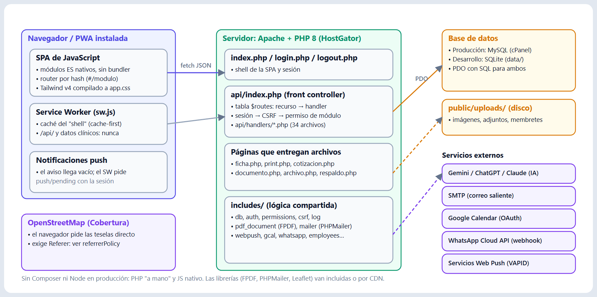
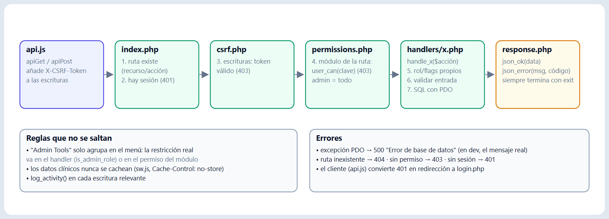
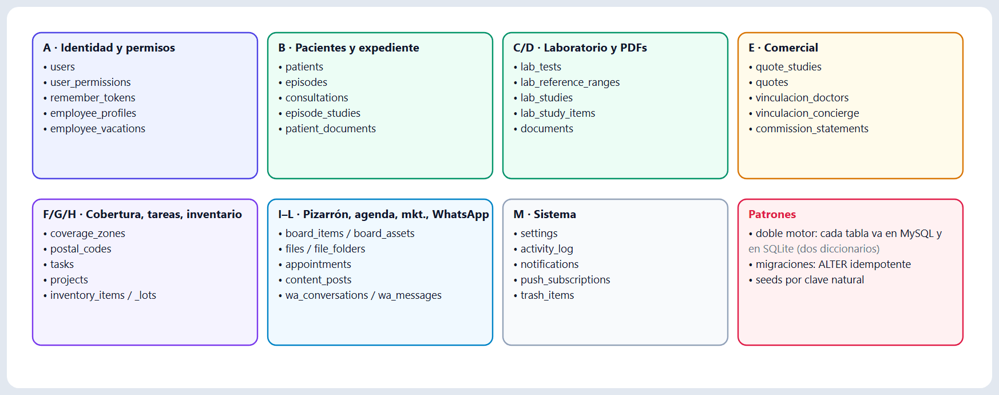
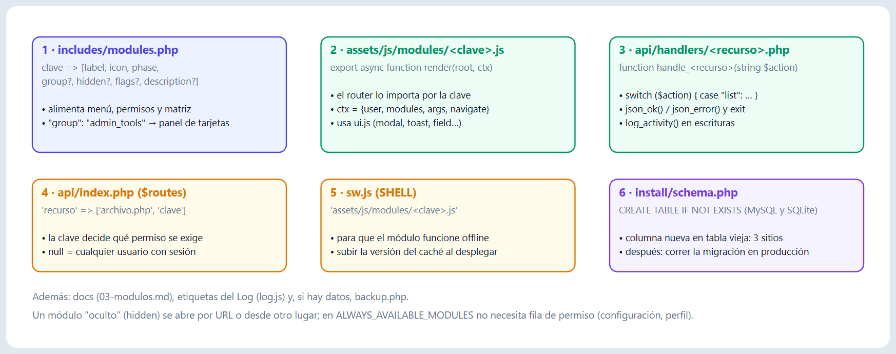
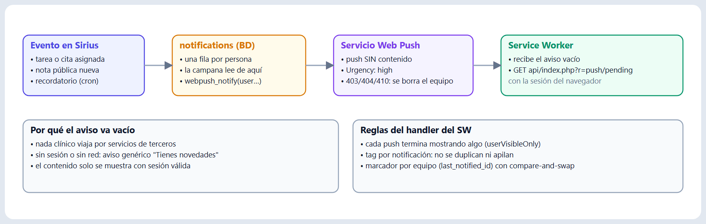
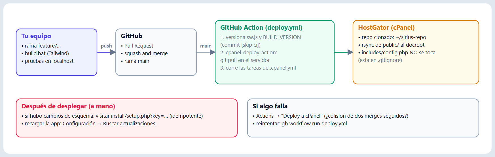

# Sirius · Manual del desarrollador

**Laboratorio y Clínica Bosques Polanco**
Versión 1.0 · octubre de 2026

> Este manual es para quien **mantiene o extiende** Sirius. Consolida y actualiza la documentación de `docs/01`–`06` (que sigue siendo la referencia detallada, capa por capa) y la **verifica contra el código actual**: 35 rutas de API, 34 handlers, 24 módulos, 51 tablas, 46 archivos JS. Lo que aquí se afirma se comprobó leyendo el código; lo que **no** se pudo probar (MySQL real, producción) se dice explícitamente.

---

## Índice

1. [Principios y stack](#1-principios-y-stack)
2. [Entorno de desarrollo](#2-entorno-de-desarrollo)
3. [Estructura del repositorio](#3-estructura-del-repositorio)
4. [Arquitectura en una página](#4-arquitectura-en-una-página)
5. [Backend: el ciclo de una petición](#5-backend-el-ciclo-de-una-petición)
6. [Autenticación, sesión y CSRF](#6-autenticación-sesión-y-csrf)
7. [Permisos y registro de módulos](#7-permisos-y-registro-de-módulos)
8. [Base de datos: doble motor, esquema y migraciones](#8-base-de-datos-doble-motor-esquema-y-migraciones)
9. [Frontend: SPA, router y kit de interfaz](#9-frontend-spa-router-y-kit-de-interfaz)
10. [PWA: service worker, offline y push](#10-pwa-service-worker-offline-y-push)
11. [Subsistemas transversales](#11-subsistemas-transversales)
12. [Despliegue y operación](#12-despliegue-y-operación)
13. [Flujo de trabajo y verificación](#13-flujo-de-trabajo-y-verificación)
14. [Recetas: cómo agregar…](#14-recetas-cómo-agregar)
15. [Trampas conocidas](#15-trampas-conocidas)
16. [Seguridad: estado y pendientes](#16-seguridad-estado-y-pendientes)
17. [Hallazgos de esta revisión](#17-hallazgos-de-esta-revisión)
18. [Referencias](#18-referencias)

---

## 1. Principios y stack

Sirius se diseñó para correr en **hosting compartido** (HostGator/cPanel): sin shell, sin Composer, sin Node en el servidor. De ahí salen las reglas que lo definen:

| Capa | Tecnología | Nota |
|---|---|---|
| Backend | **PHP 8 + PDO** | Sin framework, sin ORM, sin Composer. SQL preparado a mano. |
| Base de datos | **MySQL** (producción) · **SQLite** (desarrollo) | Un esquema escrito dos veces (§8). |
| Frontend | **JavaScript vanilla** (módulos ES) | SPA con router por hash. Sin bundler, sin framework. |
| Estilos | **Tailwind CSS v4** (binario standalone) | Se compila **localmente** y el CSS se versiona. |
| PDF | **FPDF** (copiado a `public/vendor/fpdf`) | Sin Composer. |
| Correo | **PHPMailer** (copiado a `public/vendor/phpmailer`) | |
| Despliegue | GitHub Actions → cPanel (`rsync`) | Sin build en el servidor. |

Lo que vale la pena conservar al extenderlo: **un núcleo pequeño, un registro declarativo de módulos, una sola tabla de rutas, una función por recurso, un `render()` por pantalla.** Si una tarea te empuja a introducir un framework, un bundler o una dependencia, primero revisa si el patrón existente la resuelve.

---

## 2. Entorno de desarrollo

En Windows no hay que instalar nada: `tools/` (ignorada por git) trae un **PHP portable** y el **binario de Tailwind**.

### 2.1 Primer arranque

```bat
rem 1. Compilar CSS (agrega --watch mientras desarrollas)
build.bat

rem 2. Servidor de desarrollo
tools\php\php.exe -S localhost:8080 -t public

rem 3. Crear la base (una vez): abrir
rem    http://localhost:8080/install/setup.php?key=<install_key de tu config.php>
```

Para que el paso 3 cree el usuario `Admin`, agrega a `public/includes/config.php` (no versionado) una línea `'seed_admin_password' => '<la que elijas>'`. Sin ella **no se siembra ningún usuario**. La contraseña ya no vive en el código: el repositorio es público.

### 2.2 `config.php`

Es un archivo PHP que **devuelve un arreglo**. Plantilla versionada: `public/includes/config.sample.php`.

| Clave | Para qué |
|---|---|
| `db.driver` | `'mysql'` (producción) o `'sqlite'` (desarrollo) |
| `db.host` / `name` / `user` / `pass` | DSN de MySQL |
| `db.sqlite_path` | archivo SQLite; por defecto `data/sirius.sqlite` |
| `app_env` | `'dev'` muestra errores y mensajes de excepción en las respuestas; `'prod'` los oculta |
| `install_key` | protege `install/setup.php?key=` |
| `cron_key` | protege los scripts de cron cuando se llaman por URL |
| `ca_bundle` | ruta a `cacert.pem` para TLS saliente (el PHP portable no trae uno; `tools/cacert.pem`) |
| `seed_admin_password` | *(opcional, solo dev)* contraseña con la que `setup.php` siembra `Admin` |

> `config.php` **no se versiona** y `includes/.htaccess` lo protege (`Require all denied`). En el servidor sobrevive a los despliegues porque está en `.gitignore`.

### 2.3 Particularidades del servidor de desarrollo

- `php -S` es **monohilo**: una petición lenta (por ejemplo un PDF) bloquea a las demás.
- **Ignora `.htaccess`**: no verás las cabeceras de seguridad ni las reglas de `includes/`.
- En `localhost` el `app.js` **desregistra los service workers** salvo que la URL traiga `?sw=1`, para que el desarrollo no pelee con el caché. Para probar el SW: `http://localhost:8080/?sw=1`.
- El SQLite usa `journal_mode = WAL`: pueden aparecer `sirius.sqlite-wal` y `-shm` junto al archivo; es normal. Si un script externo abre la base mientras el servidor escribe, puede haber bloqueos (`database is locked`).
- `.claude/launch.json` define el servidor `sirius` (puerto 8080) para el panel de vista previa de Claude Code.

### 2.4 Qué NO se puede probar en local

**MySQL.** El desarrollo es SQLite; el DDL de MySQL solo se revisa a ojo. Reglas para no romperlo: ver §8.3 (palabras reservadas, tipos, `JSON`, `ENUM`).

---

## 3. Estructura del repositorio

```
public/                     ← espejo 1:1 del docroot del servidor (lo único que se despliega)
  index.php                 Shell de la SPA (sidebar, topbar, menú del avatar, burbuja de IA)
  login.php / logout.php    Autenticación (formulario clásico, no SPA)
  api/index.php             Front controller JSON  (?r=recurso/acción)
  api/handlers/             34 handlers, uno por recurso
  includes/                 30 archivos: núcleo + subsistemas (§4)
  install/                  index.php (asistente), schema.php (DDL+migraciones), setup.php (aplicar por clave)
  assets/js/                app.js, api.js, router.js, ui.js, forms.js, outbox.js… + modules/ (26)
  assets/css/app.css        CSS compilado y VERSIONADO
  assets/fonts/ · img/      Inter autohospedada, iconos PWA
  vendor/fpdf · phpmailer   Librerías copiadas a mano
  uploads/*                 Contenido de usuarios (ignorado por git; cada carpeta con su .htaccess)
  sw.js · manifest.php      PWA
  *.php de entrega          ficha, print, documento, cotizacion, comision, archivo, respaldo… (§11)
  cron_*.php                Tareas programadas (§12.4)
src/tailwind.css            Fuente del build de CSS
build.bat · package.bat     Compilar CSS · empaquetar zip (primera instalación)
tools/ · data/              Desarrollo local: PHP portable, Tailwind, SQLite (ignorados)
docs/                       Referencia técnica (01–06) y estos manuales
.github/workflows/deploy.yml   CI de despliegue
.cpanel.yml                 Tarea de cPanel tras cada pull
```

**No hay pruebas automatizadas** (ni PHPUnit ni Jest). La verificación es manual y con scripts ad hoc (§13).

---

## 4. Arquitectura en una página



Los archivos de `includes/` agrupados por responsabilidad:

| Archivo | Responsabilidad |
|---|---|
| `db.php` | Conexión PDO singleton (`db()`), `app_config()`, `db_driver()`, `sql_full_name()` |
| `auth.php` | Sesión, login con freno, "recuérdame" |
| `csrf.php` · `response.php` · `log.php` | Token CSRF · `json_ok/json_error/request_body` · bitácora |
| `permissions.php` · `modules.php` | Permisos por módulo y flags · registro de módulos |
| `services.php` | Catálogo de servicios clínicos (lee `services_catalog.json`) |
| `pdf_document.php` · `letterhead.php` · `doc_templates.php` · `pdf_text.php` | Generación de PDF, membretes, plantillas de documento, lectura de texto de PDF |
| `lab_catalog.php` · `rapha_reader.php` | Catálogo y rangos de laboratorio · lector de reportes del laboratorio de referencia |
| `ai.php` · `assistant_tools.php` | Cliente multi-proveedor de IA · herramientas de solo lectura del asistente |
| `google_calendar.php` · `calendar_sync.php` | OAuth/API de Google Calendar · sincronización entrante por cron |
| `whatsapp.php` | WhatsApp Cloud API (config, envío, webhook) |
| `webpush.php` | Web Push con VAPID, sin librería |
| `mailer.php` | Correo saliente (fichas, avisos) |
| `trash.php` | Papelera polimórfica por *snapshots* |
| `backup.php` | Respaldo/restauración JSON |
| `employees.php` | Fichas de empleado, antigüedad, jornada, vacaciones |
| `geocoding.php` | Geocodificación (Nominatim/OSM) para Cobertura |
| `task_recurrence.php` · `thumbnails.php` · `branding.php` | Periodos de tareas recurrentes · miniaturas · logotipos |

---

## 5. Backend: el ciclo de una petición



**Toda** llamada a la API es `api/index.php?r=<recurso>/<acción>`. No hay reescritura de URLs ni dependencia de `mod_rewrite`.

### 5.1 El pipeline

Cada paso falla rápido con `json_error()` (que hace `exit`):

1. Se parsea `$_GET['r']`. Recurso desconocido o acción vacía → **404 «Ruta no válida»**.
2. `current_user()` → si no hay sesión, **401**.
3. Si el método **no** es GET → `csrf_verify()`; si falla, **403 «Token CSRF inválido»**.
4. Si la ruta exige módulo (`!== null`) → `user_can($módulo)`; si no, **403**.
5. `require` del handler y llamada a `handle_<recurso>(string $action)`.
6. Si el handler regresa sin haber respondido → **404 «Acción no válida»**.

La distinción lectura/escritura es **solo por método HTTP**: toda escritura es `POST` y, por tanto, lleva CSRF.

**Errores:** dos `catch` (`PDOException` y `Throwable`). Ambos hacen `error_log()` del mensaje real y solo lo devuelven al cliente si `app_env === 'dev'`; en producción responden un genérico con HTTP 500. Por eso «Error de base de datos» en producción casi siempre significa **migración pendiente** (§12.3), y el detalle está en el log de errores del hosting.

### 5.2 La tabla de rutas

Es un arreglo literal en `api/index.php`: `recurso => [archivo, clave_de_módulo | null]`. `null` = cualquier usuario autenticado.

| Recurso (`?r=`) | Handler | Permiso de módulo exigido |
|---|---|---|
| `auth/…` | `api/handlers/auth.php` | solo sesión (sin módulo) |
| `users/…` | `api/handlers/users.php` | `usuarios` |
| `patients/…` | `api/handlers/patients.php` | `expedientes` |
| `episodes/…` | `api/handlers/episodes.php` | `admision` |
| `consultations/…` | `api/handlers/consultations.php` | `expedientes` |
| `dashboard/…` | `api/handlers/dashboard.php` | `dashboard` |
| `tasks/…` | `api/handlers/tasks.php` | `tareas` |
| `inventory/…` | `api/handlers/inventory.php` | `inventario` |
| `board/…` | `api/handlers/board.php` | `pizarron` |
| `files/…` | `api/handlers/archivos.php` | `archivos` |
| `appointments/…` | `api/handlers/appointments.php` | `calendario` |
| `documents/…` | `api/handlers/documents.php` | `apps` |
| `labs/…` | `api/handlers/labs.php` | `apps` |
| `letterhead/…` | `api/handlers/letterhead.php` | `membretes` |
| `activity/…` | `api/handlers/activity.php` | `log` |
| `backups/…` | `api/handlers/backups.php` | `backup` |
| `ai/…` | `api/handlers/ai.php` | `api` |
| `calendar/…` | `api/handlers/calendar.php` | `api` |
| `assistant/…` | `api/handlers/assistant.php` | solo sesión (sin módulo) |
| `catalog/…` | `api/handlers/catalog.php` | `catalogo_estudios` |
| `quotes/…` | `api/handlers/quotes.php` | `apps` |
| `vinculacion/…` | `api/handlers/vinculacion.php` | `vinculacion` |
| `commissions/…` | `api/handlers/commissions.php` | `apps` |
| `lab_templates/…` | `api/handlers/lab_templates.php` | `plantillas_estudios` |
| `mail/…` | `api/handlers/mail.php` | `api` |
| `whatsapp/…` | `api/handlers/whatsapp.php` | `whatsapp` |
| `whatsapp_config/…` | `api/handlers/whatsapp_config.php` | `whatsapp_config` |
| `cobertura/…` | `api/handlers/cobertura.php` | `cobertura` |
| `coverage/…` | `api/handlers/cobertura.php` | `apps` |
| `papelera/…` | `api/handlers/papelera.php` | `papelera` |
| `push/…` | `api/handlers/push.php` | solo sesión (sin módulo) |
| `branding/…` | `api/handlers/branding.php` | `configuracion` |
| `employees/…` | `api/handlers/employees.php` | `empleados` |
| `profile/…` | `api/handlers/profile.php` | `perfil` |
| `marketing/…` | `api/handlers/marketing.php` | `apps` |

El mapeo **no es 1:1**: `apps` es dueño de `documents`, `labs`, `quotes`, `commissions`, `coverage` y `marketing`; y `cobertura.php` define `handle_cobertura` (Admin Tools) y `handle_coverage` (Apps) con permisos distintos.

### 5.3 Contrato de un handler

- Una función `handle_<recurso>(string $action): void`, casi siempre un `switch` grande.
- Responde con `json_ok($data)` o `json_error($mensaje, $código)`; ambas **terminan** la petición. El cliente recibe `{ok:true,data}` o `{ok:false,error,code}`.
- Lee el cuerpo con `request_body()` (JSON) o `$_GET`/`$_POST`/`$_FILES`.
- Puede hacer `require_once` de los includes que necesite: como solo se carga **un handler por petición**, eso hace de autoloader. Declara sus constantes de módulo arriba (`const TASK_PRIORITIES = [...]`).
- **Toda escritura llama a `log_activity($módulo, $acción, $detalle, $tipoEntidad, $idEntidad)`.** La bitácora nunca tumba la operación principal (captura su propia excepción).
- **Solo-administrador:** la restricción real se hace **dentro del handler** con `is_admin_role(current_user())`. Que un módulo esté en el grupo `admin_tools` solo lo agrupa en el menú; un estándar con el permiso lo vería (§7.3).
- Operaciones de varios pasos: `beginTransaction()` / `commit()` / `rollBack()` (ver `papelera.php`).

### 5.4 Archivos de entrega fuera de `api/`

Ciertas respuestas **no son JSON** (PDF, imágenes, descargas) y por eso son scripts propios en la raíz de `public/`, todos con `session_boot()` + verificación de sesión y permisos: `ficha.php`, `print.php`, `documento.php`, `documento_expediente.php`, `cotizacion.php`, `comision.php`, `archivo.php`, `board_asset.php`, `marketing_asset.php`, `whatsapp_media.php`, `respaldo.php`, `membrete_prueba.php`. Las carpetas `uploads/*` están bloqueadas por `.htaccess`: **nada se sirve directo**, todo pasa por uno de estos guardianes.

Sin sesión (llamados por terceros): `whatsapp_webhook.php` (firma/`verify_token` de Meta), `google_oauth.php` (exige administrador en sesión), `cron_*.php` (CLI o `?key=`), `version.php` (público, 4 líneas), `manifest.php`.

---

## 6. Autenticación, sesión y CSRF

**Sesión** (`auth.php`): cookie `SIRIUSSESSID`, `HttpOnly`, `SameSite=Lax`, `Secure` si hay HTTPS, `lifetime 0`. `session.gc_maxlifetime` está en **4 h** (`public/.user.ini`) para que una ficha larga de enfermería no pierda la sesión. `app.js` hace **keep-alive** cada 5 min contra `auth/session`.

**`current_user()`** devuelve `{id, username, full_name, role, is_active, theme}` (solo usuarios activos). Si no hay sesión intenta restaurarla con la cookie de «recuérdame». **No** trae correo ni fechas: datos como los de Perfil se piden a su propio endpoint.

**Login** (`attempt_login`): `password_verify`; **5 fallos → 5 min de espera** (contador en la sesión). `session_regenerate_id` al entrar.

**«Recuérdame»** (30 días): cookie `SIRIUS_REMEMBER` con un par selector/validador; en base solo se guarda el *hash* (`remember_tokens`). El token **rota** en cada uso (se borra el anterior y se emite uno nuevo). Si llega un selector válido con validador incorrecto, se **revocan todos** los tokens del usuario (señal de cookie filtrada). Ver la trampa de rotación en §15.

**CSRF** (`csrf.php`): token de 32 bytes en la sesión; se manda en la cabecera `X-CSRF-Token` (o campo `_csrf` en formularios). Se compara con `hash_equals`. En el cliente, `api.js` lo guarda con `setCsrf()` y también en `window.__siriusCsrf`, porque las subidas con `FormData` arman la cabecera a mano.

**Roles:** `estandar`, `administrador`, `developper` (el último es idéntico al administrador en la práctica).

---

## 7. Permisos y registro de módulos

### 7.1 El registro

`includes/modules.php` devuelve un arreglo `clave => definición`. **Es la fuente de verdad** del sidebar, del router, de la matriz de permisos de Usuarios y de las tarjetas de Admin Tools.

```php
'inventario' => [
    'label' => 'Inventario',
    'icon'  => 'package',            // nombre en ICONS de ui.js
    'phase' => 2,
    'flags' => ['manage' => 'Gestionar catálogo, lotes y ajustes'],
],
```

Campos: `label`, `icon`, `phase`, `flags` (privilegios por usuario), `mode_flags` (flags que cambian la forma de trabajar), `group` (`'admin_tools'`), `description` (texto de la tarjeta del panel), `hidden` (no aparece en el sidebar).

| Clave | Menú | Grupo | Oculto | Privilegios (flags) |
|---|---|---|---|---|
| `dashboard` | Dashboard | — | no | — |
| `admision` | Admisión | — | no | `wizard` |
| `expedientes` | Expedientes | — | no | `dx_assist`, `edit`, `delete` |
| `inventario` | Inventario | — | no | `manage` |
| `tareas` | Tareas | — | no | `manage` |
| `pizarron` | Pizarrón | — | no | `manage` |
| `archivos` | Archivos | — | no | `delete_shared` |
| `calendario` | Calendario | — | no | `manage` |
| `whatsapp` | WhatsApp | — | no | `manage` |
| `apps` | Apps | — | no | `membretador`, `cotizador`, `comisiones`, `cobertura`, `marketing`, `review`, `delete` |
| `usuarios` | Usuarios | admin_tools | no | — |
| `empleados` | Empleados | admin_tools | no | — |
| `membretes` | Membretes | admin_tools | no | — |
| `log` | Log | admin_tools | no | — |
| `backup` | Backup | admin_tools | no | — |
| `api` | API | admin_tools | no | — |
| `catalogo_estudios` | Catálogo de Estudios | admin_tools | no | — |
| `vinculacion` | Vinculación | admin_tools | no | — |
| `cobertura` | Cobertura | admin_tools | no | — |
| `papelera` | Papelera | admin_tools | no | — |
| `plantillas_estudios` | Plantillas de Estudios | admin_tools | no | — |
| `whatsapp_config` | WhatsApp: Configuración | admin_tools | sí | — |
| `configuracion` | Configuración | — | sí | — |
| `perfil` | Perfil | — | sí | — |

### 7.2 Cómo se decide un permiso

`permissions.php`:

- **`user_can($módulo)`**: verdadero si el módulo está en `ALWAYS_AVAILABLE_MODULES` (`configuracion`, `perfil`), o el rol es administrador/developper, o hay fila en `user_permissions` para ese usuario y módulo. Siempre exige que el módulo exista en el registro.
- **`user_flag($módulo, $flag)`**: el administrador tiene **todos** los flags… **excepto los `mode_flags`**. Un `mode_flag` (hoy solo `admision.wizard`) *recorta* la interfaz en vez de ampliarla; heredarlo por rol dejaría al administrador encerrado en el asistente, así que se exige marcado explícito.
- `user_can_for()` / `user_flag_for()` son las variantes con usuario explícito, necesarias fuera de una petición con sesión (cron del resumen diario).
- **`user_modules()`** arma la lista que recibe la SPA en `auth/session` (con `flags` calculados). El servidor es quien decide; el JS solo pinta.

`user_permissions(user_id, module_key, flags JSON)`: una fila por módulo concedido; `flags` es un JSON `{flag: true}`.

### 7.3 «Admin Tools» no es «solo administrador»

> ⚠️ El `group => 'admin_tools'` **solo agrupa**. La restricción real es `is_admin_role($me)` dentro del handler (ver `papelera.php`, `backups.php`, `employees.php`). Si agregas una herramienta administrativa y no pones esa guardia, un usuario estándar al que se le conceda el módulo accederá.

`admin_tools` es un **módulo virtual** del sidebar: no está en el registro; `app.js` agrega una sola entrada si el usuario tiene al menos una herramienta del grupo, y el router la trata como caso especial (`modules/admin_tools.js` pinta la rejilla de tarjetas con `label`/`icon`/`description` de cada módulo).

### 7.4 Visibilidad de datos (más allá de los módulos)

- **Expedientes/episodios:** un usuario estándar solo ve los episodios **asignados a él o a «General»** (`assigned_user_id IS NULL`). `require_episode_visible()` y `patient_is_visible()` lo aplican en servidor.
- **Archivos/pizarrón:** alcance `privado` (dueño) o `público`.
- **Perfil:** el endpoint no recibe `user_id` (siempre el de la sesión) y **omite en el servidor** los campos que el administrador no quiso mostrar.

---

## 8. Base de datos: doble motor, esquema y migraciones



### 8.1 Doble motor

`db()` crea un PDO con `ERRMODE_EXCEPTION`, `FETCH_ASSOC` y `EMULATE_PREPARES = false`. SQLite activa `foreign_keys` y `WAL`; MySQL usa `utf8mb4`. No hay ORM: cada handler escribe su SQL.

Las diferencias entre motores viven en **tres lugares**: `sql_full_name()`, el esquema (`install/schema.php`) y `includes/backup.php`. Todo SQL de handlers debe ser portable; evita funciones propias de un motor (`JSON_SET`, `GROUP_CONCAT` con separadores distintos, `DATE_ADD`…). Para fechas, calcúlalas en PHP.

### 8.2 `install/schema.php`: tres funciones y tres reglas

| Función | Qué hace |
|---|---|
| `sirius_schema_tables($pdo, $isMysql)` | Un diccionario **por motor** (`CREATE TABLE IF NOT EXISTS`), en un bloque MySQL y otro SQLite |
| `sirius_schema_migrations($pdo, $isMysql)` | Lista de `ALTER TABLE … ADD COLUMN` envueltos en `try/catch` (si la columna ya existe, la excepción se traga) + índices de SQLite + migraciones de datos |
| `sirius_seed_*` | Semillas por clave natural (settings, WhatsApp, cobertura, fechas conmemorativas) |

`sirius_install_schema()` las encadena. La invoca el asistente `install/index.php` y, **en cada actualización**, `install/setup.php?key=…`.

**Regla de los tres lugares.** Una **tabla nueva** se escribe en **ambos** bloques (MySQL y SQLite) + su índice en la rama SQLite. Una **columna nueva en una tabla vieja** se escribe en **tres** lugares: el `CREATE TABLE` MySQL (para instalaciones nuevas), el `CREATE TABLE` SQLite y la lista de migraciones (para las existentes). Olvidar uno rompe un entorno distinto cada vez.

**Idempotencia.** Todo debe poder correrse dos veces. Las migraciones de datos usan `INSERT IGNORE` / `INSERT OR IGNORE` (según motor) y comprobaciones previas.

### 8.3 Reglas para que el DDL de MySQL no falle

Como MySQL no se puede probar en local:

- **Palabras reservadas** como nombre de columna o tabla (`lines`, `groups`, `rank`, `key`, `condition`, `desc`, `order`…) rompen MySQL y *no* SQLite. Ya mordió una vez con `lines`. Usa nombres compuestos (`line_items`, `sort_order`).
- Tipos: `INT UNSIGNED … AUTO_INCREMENT` ↔ `INTEGER PRIMARY KEY AUTOINCREMENT`; `TINYINT(1)` ↔ `INTEGER`; `DATETIME`/`TIMESTAMP` ↔ `TEXT`; `ENUM` ↔ `TEXT`; `JSON` ↔ `TEXT`.
- MySQL: `ENGINE=InnoDB … utf8mb4_unicode_ci` (variable `$suffix`).
- Un `ADD UNIQUE KEY` sobre una tabla con filas va **aparte** del bucle de migraciones (ver `uq_episode_client_uuid`).
- `ALTER … MODIFY` solo existe en MySQL: condiciónalo con `if ($isMysql)`.

### 8.4 Inventario de tablas (51)

| Grupo | Tablas |
|---|---|
| Identidad y permisos | `users`, `user_permissions`, `remember_tokens`, `employee_profiles`, `employee_vacations` |
| Pacientes y clínico | `patients`, `episodes`, `consultations`, `episode_studies`, `patient_documents`, `dismissed_alerts` |
| Laboratorio | `lab_studies`, `lab_study_items`, `lab_tests`, `lab_reference_ranges` |
| Documentos | `documents` |
| Comercial | `quotes`, `quote_studies`, `commission_statements`, `commission_entries`, `result_deliveries`, `vinculacion_doctors`, `vinculacion_concierge` |
| Cobertura | `postal_codes`, `coverage_zones` |
| Tareas | `tasks`, `task_assignees`, `task_completions`, `projects`, `project_assignees` |
| Inventario | `inventory_items`, `inventory_lots`, `inventory_movements` |
| Pizarrón y archivos | `board_items`, `board_assets`, `files`, `file_folders` |
| Calendario | `appointments` |
| Marketing | `content_posts`, `marketing_assets`, `commemorative_dates` |
| WhatsApp | `wa_conversations`, `wa_messages`, `wa_statuses`, `wa_quick_replies`, `wa_auto_messages` |
| Sistema | `settings`, `activity_log`, `notifications`, `push_subscriptions`, `trash_items` |

El detalle columna por columna está en [`docs/02-modelo-de-datos.md`](../02-modelo-de-datos.md).

### 8.5 `settings`: almacén llave/valor

Configuración que no vive en `config.php` se guarda como filas `skey`/`svalue` (a menudo un **blob JSON**): `ai`, `mail`, `google_calendar`, `whatsapp`, `letterhead`, `branding`, `clinic_name`, llaves VAPID… Cada subsistema tiene su par `*_config()` / `*_save()` con **lista blanca** de claves y la regla «**secreto vacío = no cambiar**» para poder mostrar campos enmascarados.

### 8.6 Respaldo y tablas nuevas

`backup.php` tiene **listas explícitas** de tablas (`backup_groups()`, `backup_table_order()`): una tabla nueva **no se respalda sola**. Agrégala en el grupo correcto y respeta el orden de dependencias (después de `users`). Los respaldos incluyen secretos de `settings` y *hashes* de contraseña, y **no** incluyen `uploads/`.

---

## 9. Frontend: SPA, router y kit de interfaz

### 9.1 Arranque (`app.js`)

`index.php` **no manda datos de usuario en el HTML**. `boot()`: captura el evento de instalación de PWA (antes de todo, para no perderlo) → `apiGet('auth/session')` → `setCsrf` y estado `{user, modules, registry, features, activeModule}` → topbar → sidebar → menús → asistente de IA → router → registro del service worker → keep-alive → campana de notificaciones (sondeo cada 20 s).

### 9.2 Router (`router.js`)

Hash `#/<módulo>[/arg1/arg2…]`; vacío → `dashboard`. Es **consciente de permisos**: busca la clave en la lista que calculó el servidor; si no existe o está prohibida cae al primer módulo disponible. La carga es un `import()` dinámico nativo:

```js
const m = await import('./modules/' + moduleKey + '.js');
await m.render(root, { ...appState, args, navigate });
```

### 9.3 Contrato de un módulo



Una sola exportación:

```js
export async function render(root, ctx)
// ctx = { user, modules, registry, features, activeModule, args, navigate }
```

`args` es el resto de la ruta (`#/apps/membretador/hematologia` → `['membretador','hematologia']`). Las sub-vistas son un `if (args[0] === 'x')` al inicio de `render()`.

> ⚠️ **Mismo hash = no se vuelve a pintar.** Navegar a la ruta en la que ya estás no re-renderiza. Para forzar, navega a otro hash y regresa.

### 9.4 `ui.js`: el kit compartido

`ICONS` + `icon(name, cls)` (cae a `folder` si no existe), `escapeHtml`, `mdLite` (markdown mínimo, escapa primero), `toast`, `modal({title, content, actions, size})` → `{close, el}`, `confirmDialog`, `isUserBusy`, `inputCls`/`labelCls`, `field(def, value)`, `formValues(form)`, `fmtDate`/`fmtDateTime`/`fmtRelative`, `calcAge`, `spinner`, `debounce`.

Filosofía: **plantillas de cadena con `escapeHtml`**, `innerHTML =` para cambiar de vista, listeners re-atados tras cada render. Sin DOM virtual ni reactividad. **Toda interpolación de datos de usuario debe pasar por `escapeHtml`** (o `textContent`).

### 9.5 `api.js`

`apiGet(route, params)` y `apiPost(route, body)` devuelven **`json.data` ya desenvuelto**. `401` → redirección dura a `login.php` (por eso un módulo puede hacer `catch {}` sin más). `ok:false` → lanza `Error` con `.message` y `.code`. Todo con `cache: 'no-store'`.

### 9.6 Formularios dirigidos por JSON

`assets/js/services_catalog.json` define, por servicio (`laboratorio`, `control_peso`, `fisioterapia`, `podologia`) y por etapa (`admission` | `session`), una lista de **secciones** con **campos** (`k` = clave, `t` = tipo). `forms.js` los pinta (`sectionsHtml`), llena (`fillSections`), activa (`initSections`) y cosecha (`collectSections`). Tipos: `text/number/date/email/tel`, `textarea`, `select`, `checkbox`, `checkdetail` (checkbox con «especificar», guarda además `<k>_det`), `symptom` (síntoma con duración), `calc` (calculado: IMC, ICC, ICE, suma de pliegues…) y `signature` (canvas). Hay secciones condicionales por sexo (`showIf`).

**El mismo JSON es la lista blanca del servidor**: `service_allowed_keys()` en `services.php` calcula qué llaves acepta `service_data`. Por eso **agregar un campo = editar solo el JSON** (§14.3).

`doc_templates.json` hace lo mismo para los estudios de Biología Molecular de Apps.

### 9.7 Tailwind

`src/tailwind.css` = `@import "tailwindcss"` + **`@source "../public"`** (escanea PHP, JS y JSON de `public/`) + `@theme` (fuente Inter autohospedada) + variables CSS para los 8 temas por usuario (`[data-theme]`). No existe `tailwind.config.js`.

> ⚠️ **Dos reglas diarias.** (1) **Corre `build.bat` después de usar una clase nueva**: el CSS compilado está versionado y el servidor nunca compila; sin esto, la clase no existe en producción. (2) El escaneo es **literal**: las clases deben aparecer **completas** como cadena en el código. `bg-${color}-100` **no** funciona; usa un diccionario con las clases enteras (`{amber: 'bg-amber-100', …}`).

`build.bat` genera en `%TEMP%` y copia a `public/assets/css/app.css` porque el binario falla al escribir en rutas con espacios (este proyecto está bajo `C:\Users\Alan RodGar\`).

---

## 10. PWA: service worker, offline y push

### 10.1 `sw.js`

- **`CACHE = 'sirius-shell-<sha>'`**: lo reescribe el CI en cada despliegue; el nombre del caché **es** la versión.
- **`SHELL`** es una lista de precaché **mantenida a mano**.
- Estrategias: (1) **red directa, sin caché** para otros orígenes, `/api/`, `/install/`, `/uploads/` y los scripts PHP de entrega (login, print, documento, cotizacion, comision, archivo, respaldo, webhook, manifest…): **los datos clínicos nunca se cachean**; (2) **navegaciones**: red primero, `offline.html` si falla; (3) **todo lo demás**: caché primero (`ignoreSearch`), red como respaldo.
- **Sin `skipWaiting()` automático**: una versión nueva espera hasta que la página manda `{type:'SKIP_WAITING'}` (botón *Buscar actualizaciones* en Configuración). Nadie se actualiza a media sesión.
- Segundo canal de versión: `version.php` devuelve `{"version": BUILD_VERSION}`; Configuración lo compara con `<meta name="app-version">`, sin depender del ciclo de vida del SW.

> ⚠️ **Al agregar un archivo JS/CSS/JSON, agrégalo a `SHELL`.** No hay red de seguridad. Al revisar este manual se encontraron 4 archivos que faltan (§17).

### 10.2 Captura offline (`outbox.js`)

El asistente de admisión de los recolectores a domicilio guarda la admisión en **IndexedDB** si no hay red (`outboxEnqueue`) y la reenvía al volver la conexión (`outboxFlush`, evento `online` + *Background Sync* `sync-wizard-outbox` en el SW). Cada admisión lleva un **`client_uuid`** (índice único en `episodes`): el servidor responde idempotente ante reintentos y no duplica.

### 10.3 Push



Web Push **sin librería** (`webpush.php`: VAPID + JWT ES256 a mano). El push va **sin contenido** a propósito (evita implementar el cifrado del RFC 8291 y que el texto llegue a un equipo compartido): el SW, al recibirlo, pide a `push/pending` la siguiente notificación **de ese dispositivo**. Detalles que importan:

- `Urgency: high`, o FCM retiene el mensaje con el teléfono en reposo.
- **Una entrega por dispositivo**: `push_subscriptions.last_notified_id` es el marcador de cada dispositivo (compare-and-swap en `pending`). Antes se usaba `read_at` y con dos dispositivos solo el primero recibía.
- El handler `push` **siempre muestra algo** (Chrome lo exige con `userVisibleOnly`).
- `cron_push_reminders.php` manda un resumen diario por usuario.
- Claves VAPID en `settings`; generación en `webpush_generate_vapid_keys()`.

---

## 11. Subsistemas transversales

### 11.1 PDF (`pdf_document.php`, FPDF)

Clase `SiriusDocPDF extends FPDF`. Funciones públicas: `render_lab_report`, `render_document_pdf` (estudios de Biología Molecular), `render_patient_record_pdf` (expediente/visita), `render_ficha_pdf` (ficha de identificación), `render_quote_pdf` (+ página de logística), `render_commission_pdf`.

- **Codificación ISO-8859-1**: todo texto pasa por `pdf_t()`. Caracteres fuera de Latin-1 se imprimen como `?` (p. ej. **Ω**: por eso el campo es «Impedancia (ohmios)»).
- **Membrete** (`letterhead.php`): header, footer, marca de agua y firma. FPDF no soporta transparencia: los PNG con alfa se **aplanan sobre blanco** y se cachean en `uploads/membretes/cache/`.
- **Ficha** (`render_ficha_pdf`): para **Laboratorio** = ficha + consentimiento informado + **aviso de privacidad completo en hoja aparte**; para los demás servicios termina en el consentimiento. `print.php` redirige un episodio de laboratorio a `ficha.php`; el agregado del paciente excluye laboratorio.
- `identBlock` envuelve texto largo (correo en su propia línea siempre; síntomas con salto de línea) respetando el margen de la tabla.
- `pdf_text.php` extrae texto de PDF **en PHP puro**: se usa para reconocer campos de la ficha subida en Membretador.

### 11.2 IA (`ai.php`, `assistant_tools.php`)

Cliente multi-proveedor (Gemini, OpenAI, Claude). **Las llamadas salen del servidor**: las llaves nunca llegan al navegador. Configuración en `settings.skey='ai'`; `api_key` vacía = no cambiar. El transporte prefiere cURL y cae a `stream_context` si no está compilado.

> ⚠️ **El *tool-calling* solo está implementado para Gemini** (hasta 4 rondas). Con OpenAI o Claude, `$tools` se ignora en silencio. El asistente (`assistant.php`) y Marketing lo toleran porque, para acciones, piden texto en formato fijo y lo parsean. Las herramientas del asistente (`assistant_tools.php`) son **de solo lectura** y filtran por lo que puede ver el usuario que pregunta.

### 11.3 Correo (`mailer.php`, PHPMailer)

Configuración SMTP en `settings.mail`. `mail_send()` con adjuntos; `ficha_send_email()` envía la ficha por correo al paciente (reenviable) y valida/une destinatarios y copias ocultas. Si el correo no está listo (`mail_is_ready()`), la operación principal continúa y solo se omite el envío.

### 11.4 Google Calendar (`google_calendar.php`, `calendar_sync.php`, `google_oauth.php`)

Cuenta única compartida con OAuth 2.0. Sincronización **saliente** al crear/editar citas y **entrante por sondeo** (`cron_calendar_sync.php`, no webhooks).

> ⚠️ **ModSecurity del hosting** puede bloquear el regreso de Google a `/google_oauth.php` («Not Acceptable!») porque el parámetro `iss=https://accounts.google.com` y `scope=https://…` contienen URLs. La solución es **del lado del hosting** (excluir esa ruta de la regla); alternativas de código, sin implementar: cuenta de servicio, o flujo de «pegar el código» manual.

### 11.5 WhatsApp (`whatsapp.php`, `whatsapp_webhook.php`)

Cloud API de Meta, cuenta única. El webhook **guarda primero y responde 200 siempre** (Meta reintenta en bucle si no). OJO: PHP convierte los puntos de `hub.mode` en guiones bajos dentro de `$_GET` (`hub_mode`, `hub_verify_token`, `hub_challenge`). Regla de las 24 h para responder libremente. La media se descarga a `uploads/whatsapp/` y se sirve por `whatsapp_media.php`. Los estatus y mensajes automáticos se siembran con `sirius_seed_whatsapp()`.

### 11.6 Cobertura (`cobertura.php`, `geocoding.php`, `coverage_map.js`)

Municipios/alcaldías y códigos postales con cobertura, costo extra y geocodificación con Nominatim. El mapa usa teselas de OpenStreetMap: como `public/.htaccess` envía `Referrer-Policy: same-origin` y OSM responde 403 sin `Referer`, el mapa declara **su propio `referrerPolicy` en cada capa de teselas** (`coverage_map.js`).

### 11.7 Papelera (`trash.php`)

Soft-delete polimórfico por **snapshots JSON** en `trash_items` (`{row, assignees?, completions?}`). El punto de extensión son **listas blancas de columnas** (`TRASH_*_COLUMNS`): agregar una entidad = una constante + un `case` en `trash_restore_row()` + una llamada a `trash_archive()` en el punto de borrado. Cascadas con `related_trash_id`; restaurar un proyecto restaura sus tareas; si el `project_id` ya no existe, se restaura en la raíz. Los binarios de archivos permanecen en disco mientras están archivados.

> ⚠️ `trash_insert_exact()` **reinserta la llave primaria original**: con AUTO_INCREMENT puede chocar si otra fila tomó ese id.

### 11.8 Empleados y Perfil (`employees.php`)

- **Antigüedad** (`employee_tenure`): algoritmo de **mes ancla** (años/meses/días calendario), con espejo en JS (`tenureText`); se verificó igualdad PHP/JS en 14 pares de fechas, incluidos 31-ene→1-mar y 29-feb.
- **Vacaciones**: los días se cuentan **solo en días laborales de la jornada** (`employee_count_days`); sin traslapes entre registros; el administrador puede corregir el número. `vacation_preview` (POST) recibe la jornada **que está en pantalla** para que la vista previa no dependa de lo guardado.
- **Jornada**: JSON `{days:{mon:{on,from,to},…}, note}` normalizado por `employee_normalize_schedule`.
- **Visibilidad**: `visible_fields` (JSON) decide qué ve el empleado; el filtro se aplica **en servidor** (`employee_view($user, true)`).
- Zona horaria fija `America/Mexico_City`. Al eliminar un usuario, sus filas de ambas tablas se borran solas por `ON DELETE CASCADE` (el handler `users/delete` no hace nada extra).

### 11.9 Báscula Bluetooth (`scale_connect.js`, `scale_decoders.js`, `body_composition.js`)

Web Bluetooth (Chrome/Edge en Windows y Android, solo HTTPS). El **registro de decodificadores está vacío** hasta recibir el reporte de `bascula_prueba.php` de la báscula real: por eso la lectura automática no funciona todavía y el módulo deja capturar a mano. Las composiciones corporales (Sun 2003, Mifflin–St Jeor) se rotulan «**estimado**».

### 11.10 Marketing, Comisiones, Cotizador

Marketing (`marketing.php`, `marketing_panel.js`) planea contenido con fechas conmemorativas e IA. Cotizador (`quotes.php`) guarda **copia** de nombre/precio/cantidad por partida: borrar un estudio del catálogo no altera cotizaciones emitidas. Comisiones (`commissions.php`) liquida por grupos (`commission_group`) y concierge/médico vinculado.

---

## 12. Despliegue y operación



### 12.1 Pipeline

1. **Merge a `main`** dispara `.github/workflows/deploy.yml`.
2. El workflow **versiona el SW**: reemplaza `sirius-shell-…` por `sirius-shell-<sha>` en `sw.js`, escribe `public/BUILD_VERSION` y **commitea de vuelta** a `main` con `[skip ci]` (el commit `chore: versiona sw.js (<sha>)`).
3. `pinkasey/cpanel-deploy-action` dispara el *pull* en cPanel (secretos de repo: `CPANEL_HOSTNAME`, `CPANEL_REPOSITORY_ROOT`, `CPANEL_USERNAME`, `CPANEL_TOKEN`).
4. cPanel ejecuta `.cpanel.yml`: `rsync -a --exclude=.git public/ /home4/alanrod2/sirius-bpm.com/`.

`docs/`, `src/`, `tools/`, `data/` **nunca llegan al servidor**. `config.php` y `uploads/*` están en `.gitignore` y sobreviven.

> ⚠️ **No fusiones dos PR con pocos segundos de diferencia.** El paso 2 hace `git push` a `main`; si otro merge cae en medio, el push falla con «fetch first» y esa corrida de despliegue termina en rojo (la siguiente corrida sí despliega ambos, pero queda un fallo en el historial). Espera a que termine el despliegue antes de fusionar el siguiente.

### 12.2 Primera instalación

Dos caminos: **`package.bat`** genera `sirius-deploy.zip` (excluye `tools/`, `data/`, `config.php`, `.installed` y el contenido de `uploads/`); se sube y se extrae en `public_html`; luego `https://dominio/install/` (asistente: pide datos de MySQL y del administrador, **escribe `config.php`**, genera `install_key` y `cron_key`, corre el esquema, siembra el administrador y se autobloquea con `install/.installed`). Las claves se muestran **una sola vez**. Tras instalar, activar SSL y **descomentar el bloque HTTPS de `public/.htaccess`**.

### 12.3 Migraciones: manuales

**El pipeline no corre migraciones.** Tras un despliegue que cambia el esquema hay que visitar:

```
https://sirius-bpm.com/install/setup.php?key=<install_key>
```

Compara la clave con `hash_equals` e imprime en texto plano el registro de `sirius_install_schema()`. Es idempotente y no destructivo. **Síntoma de que se olvidó:** un módulo nuevo dice «Error de base de datos» / «no se pudo cargar» (caso real: Empleados, tablas nuevas).

> ⚠️ La clave es el único control de ese endpoint (sin sesión, sin límite de intentos) y viaja en la URL, así que **queda en los logs de acceso**. Considera rotarla periódicamente y no pegarla en chats ni tickets.

### 12.4 Tareas programadas (cron de cPanel)

| Script | Frecuencia | Qué hace |
|---|---|---|
| `cron_push_reminders.php` | 1 vez al día, temprano | Resumen push por usuario (tareas y citas del día, resultados por entregar) |
| `cron_calendar_sync.php` | cada 5–15 min | Trae cambios de Google Calendar a Sirius |

Dos formas: por línea de comandos (recomendada, no necesita clave) `/usr/local/bin/php /home/usuario/public_html/cron_push_reminders.php`, o por URL `…?key=<cron_key>`.

### 12.5 Diagnóstico en producción

| Síntoma | Dónde mirar |
|---|---|
| «Error de base de datos» tras un despliegue | ¿Se corrió `setup.php`? Si sí, el log de errores de PHP en cPanel (el detalle real solo se escribe ahí con `app_env=prod`) |
| Pantalla vieja tras desplegar | `Configuración → Buscar actualizaciones`; revisar `version.php` vs `<meta name="app-version">` |
| Clase de Tailwind «no existe» en producción | No se corrió `build.bat` antes del commit |
| Módulo nuevo no carga sin red | No está en `SHELL` de `sw.js` |
| 403 «Not Acceptable!» en una URL con parámetros | ModSecurity del hosting (§11.4) |
| Push que «a veces no llega» | Botón de prueba de la campana; en Windows, navegador en segundo plano y sin «Asistente de concentración»; en Android, sin ahorro de batería para el navegador |

### 12.6 Restricciones heredadas del hosting compartido

Ruteo por `?r=` (sin `mod_rewrite`), FPDF/PHPMailer copiados a mano (sin Composer), un `require` por handler (sin PSR-4), Tailwind compilado en local con CSS versionado (sin Node), cURL opcional, `.user.ini` en vez de `php.ini`, migraciones por URL, despliegue por `rsync`. Todo esto **se puede relajar** con otro hosting; la **forma** (núcleo pequeño, registro de módulos, tabla de rutas) conviene conservarla.

---

## 13. Flujo de trabajo y verificación

### 13.1 Ramas, commits y PR

1. Rama desde `main` (`feat/…`, `fix/…`, `docs/…`).
2. Commits claros en español; el mensaje explica el **porqué**.
3. `gh pr create` con resumen y plan de verificación.
4. **Fusión solo cuando el responsable lo autoriza** (`gh pr merge N --squash --delete-branch`). Fusionar a `main` **despliega a producción**.
5. Esperar el despliegue en verde (`gh run list`), actualizar `main` local con `git pull --ff-only`.
6. Si el cambio toca esquema → correr `setup.php` en producción (§12.3).

Los cambios solo de `docs/` no se despliegan (están fuera de `public/`).

### 13.2 Lista de verificación antes de abrir el PR

- [ ] `php -l` de cada PHP tocado (`tools\php\php.exe -l archivo.php`).
- [ ] `build.bat` si usaste clases de Tailwind nuevas; el `app.css` va en el commit.
- [ ] Esquema nuevo escrito en **MySQL + SQLite** (+ índice SQLite; columna vieja ×3) y sin palabras reservadas.
- [ ] Tabla nueva agregada a `backup.php`.
- [ ] Archivo JS nuevo agregado a `SHELL` en `sw.js`.
- [ ] Toda escritura con `log_activity()` y su etiqueta en `ACTIONS` de `modules/log.js`.
- [ ] Guardia `is_admin_role()` si la herramienta es solo para administradores.
- [ ] Datos de usuario en HTML pasan por `escapeHtml`.
- [ ] Probado en navegador a escritorio y a **375 px**, con consola sin errores.
- [ ] Probado con un usuario **estándar** (¿ve solo lo suyo?), no solo como administrador.
- [ ] Dos corridas de `setup.php` seguidas (idempotencia).

### 13.3 Cómo se verificó en este proyecto (sin pruebas automáticas)

- **API:** peticiones `POST` con sesión y token CSRF contra el servidor de desarrollo (script con `requests`/`urllib`), casos felices y de rechazo (traslapes, fechas invertidas, correo inválido, 403 de un estándar).
- **Cálculos duplicados PHP/JS:** comparar ambos con las mismas entradas (p. ej. antigüedad en 14 pares de fechas).
- **Interfaz:** panel de vista previa de Claude Code (`preview_start` con `sirius`) o Edge headless con CDP; leer el árbol de accesibilidad antes que capturar imágenes.
- **PDF:** generar y **convertir a imagen** (PyMuPDF) para revisarlos a ojo; `pdftotext` no detecta desbordes de margen.
- **Capturas de estos manuales:** entorno de demostración con **datos ficticios** y Edge headless (≈132 imágenes); el script de siembra y el de capturas no se versionaron (viven fuera del repositorio).

---

## 14. Recetas: cómo agregar…

### 14.1 Un módulo nuevo (con API)

1. **Registro:** entrada en `includes/modules.php` (`label`, `icon`, `phase`, `flags`, y `group`/`description` si va en Admin Tools; `hidden` si no va al sidebar).
2. **Interfaz:** `assets/js/modules/<clave>.js` con `export async function render(root, ctx)`.
3. **API:** `api/handlers/<recurso>.php` con `handle_<recurso>($action)`; registrar la ruta en `$routes` de `api/index.php` (`[archivo, clave|null]`).
4. **Solo-admin:** añadir `is_admin_role()` en el handler si corresponde.
5. **Precaché:** agregar el JS a `SHELL` de `sw.js`.
6. **Bitácora:** etiquetas nuevas en `ACTIONS` de `modules/log.js`.
7. **Icono:** si usas uno nuevo, agrégalo a `ICONS` de `ui.js`.
8. **Docs:** conteos en `docs/` y, si cambia lo que ve el usuario, los manuales.

El sidebar, el router, la matriz de permisos de Usuarios y la rejilla de Admin Tools lo recogen solos.

### 14.2 Un módulo siempre disponible (como Perfil)

`hidden => true` en el registro + añadir su clave a `ALWAYS_AVAILABLE_MODULES` en `permissions.php`. Si se abre desde el menú del avatar, el enlace es HTML estático en `index.php`.

### 14.3 Un campo a un formulario de servicio

Editar `assets/js/services_catalog.json` (sección → `fields` → `{k, t, label…}`). El servidor lo acepta automáticamente (`service_allowed_keys`). Si es calculado, agregar su función a `CALCS` en `forms.js`. Si debe salir en el PDF de la ficha o del expediente, revisar `render_pdf_service_sections` / `render_ficha_pdf`.

### 14.4 Una tabla nueva

Bloque MySQL **y** SQLite en `sirius_schema_tables`, índice en la rama SQLite de `sirius_schema_migrations`, entrada en `backup_groups()`/`backup_table_order()`, y, si guarda datos de un usuario, limpieza en `users/delete`. Evitar palabras reservadas. Correr `setup.php` dos veces en dev.

### 14.5 Una columna nueva en tabla existente

`CREATE TABLE` MySQL + `CREATE TABLE` SQLite + `ALTER TABLE … ADD COLUMN` en la lista de migraciones (con la sintaxis de cada motor: `($isMysql ? '… NULL' : '… NULL')`). Revisar `backup.php` (usa las columnas reales de la tabla, pero conviene confirmarlo) y los `SELECT` que enumeran columnas.

### 14.6 Una acción nueva en un handler

Agregar un `case` al `switch`; leer con `request_body()`; validar y **normalizar con lista blanca**; `log_activity()`; `json_ok()`. Si es de escritura, el cliente debe usar `apiPost`.

### 14.7 Un PDF nuevo

Función `render_*` en `pdf_document.php` sobre `SiriusDocPDF`, todo texto por `pdf_t()`, membrete con el helper existente, script de entrega en la raíz de `public/` con sesión y permiso, y su nombre en la lista «red directa» de `sw.js`.

### 14.8 Una integración con secretos

Seguir la **tríada `get` / `save` / `test`**: config en `settings` como blob JSON con lista blanca; `save` ignora el secreto vacío; `get` devuelve el secreto enmascarado; `test` hace una llamada real y reporta. Va dentro del módulo `api` (solo administrador).

### 14.9 Una entidad a la papelera

Constante `TRASH_<X>_COLUMNS`, `case` en `trash_restore_row()`, `trash_archive()` en el borrado y, si tiene tablas laterales, incluirlas en el snapshot.

---

## 15. Trampas conocidas

| Trampa | Detalle | Cómo evitarla |
|---|---|---|
| **Palabras reservadas de MySQL** | `lines` rompió el DDL MySQL sin romper SQLite | Nombres compuestos; revisar el DDL a ojo |
| **Olvidar la migración** | «Error de base de datos» en producción tras desplegar un cambio de esquema | Correr `setup.php` siempre; avisar en el PR |
| **`sw.js` y `SHELL`** | Archivo nuevo sin precachear: no funciona offline | Checklist §13.2 |
| **`sw.js` usa finales CRLF** | El `sed` del CI reemplaza `sirius-shell-…` por patrón; un editor que normalice CRLF↔LF reescribe todo el archivo y ensucia el diff | Conservar los finales de línea al editarlo |
| **Dos merges seguidos** | El `git push` del CI falla con «fetch first» | Esperar el despliegue en verde |
| **`.currentTarget` tras un `await`** | Se vuelve `null`; `.target` no | Guardar `const el = e.currentTarget` antes del `await` |
| **Mismo hash no re-renderiza** | Navegar a la ruta actual no hace nada | Ir a otro hash y volver |
| **Clases de Tailwind dinámicas** | `bg-${x}-100` no se genera | Diccionarios con clases completas; `build.bat` |
| **`php -S`** | Monohilo; ignora `.htaccess` | No sacar conclusiones de seguridad/cabeceras en local |
| **SQLite bloqueado** | Un script externo abierto mientras el servidor escribe | Cerrar conexiones; WAL ayuda pero no elimina |
| **Ω y otros no-Latin-1 en PDF** | Salen como `?` | Reemplazar el texto («ohmios») |
| **`sex` NOT NULL en rangos de referencia** | `lab_save_test` valida con `$r['sex'] ?? 'A'` pero inserta `$r['sex']`: si la clave viene presente con `null`, se inserta `NULL` y falla la restricción | Mandar siempre `'A'`/`'F'`/`'M'` (hallazgo 4 de §17) |
| **«Recuérdame» y la rotación** | El token se rota en cada uso: si dos peticiones llegan a la vez con la misma cookie, la segunda no encuentra el selector (ya borrado) y se queda sin sesión | Es raro y se corrige iniciando sesión de nuevo |
| **`trash_insert_exact`** | Reinserta el id original | No depender de ids únicos tras purgar/restaurar |
| **Tool-calling solo Gemini** | Con OpenAI/Claude `$tools` se ignora | Texto de formato fijo o portar el *tool-calling* |
| **Webhook de WhatsApp** | `hub.mode` llega como `hub_mode` | Leer con guion bajo |
| **ModSecurity y OAuth** | Bloquea URLs en parámetros | Excepción en el hosting (§11.4) |
| **`Referrer-Policy: same-origin`** | OSM responde 403 sin `Referer` | `referrerPolicy` por capa (§11.6) |
| **`config.php` ausente** | Todo falla con un fatal de `require` | Copiar de `config.sample.php` |
| **Un estándar «no ve» a su paciente** | Episodio asignado a otro | Reasignar o dejar en «General» |
| **Cambiar el `name` del manifest** | Está hard-codeado a «Bosques Polanco» (también en `login.php` e `index.php`) aunque existe `settings.clinic_name` | Conectarlo a la configuración si se reutiliza el producto |

---

## 16. Seguridad: estado y pendientes

**Controles presentes:** sesiones `HttpOnly`/`SameSite`, `session_regenerate_id` al entrar, CSRF en toda escritura, **PDO preparado** en todas las consultas, permisos verificados **en servidor**, `includes/` y `uploads/` bloqueados por `.htaccess`, archivos servidos solo por guardianes PHP, `X-Content-Type-Options: nosniff`, `X-Frame-Options: SAMEORIGIN`, el SW **jamás** cachea API ni datos clínicos, borrado lógico de pacientes (`is_deleted`), llaves de IA/correo/WhatsApp solo en servidor.

**Pendientes y riesgos conocidos** (por orden de importancia):

1. **Rotar secretos compartidos en chats/tickets**: contraseña de MySQL, `install_key`, `cron_key`. Si se pegaron en una conversación, considerarlos expuestos.
2. **`install_key` en la URL** de `setup.php`: queda en logs de acceso; sin límite de intentos ni sesión.
3. **La contraseña de desarrollo estuvo en el README público**: ya se quitó, pero **sigue en el historial de git**; asumir que es conocida y no reutilizarla.
4. **Los respaldos contienen secretos** (`settings`: llaves de IA/correo/WhatsApp; *hashes* de contraseñas). Guardarlos como material sensible.
5. **Sin cabecera CSP** y **bloque HTTPS de `.htaccess` comentado** (HostGator ya sirve SSL, pero la redirección forzada debe activarse).
6. `install/` debería **borrarse o bloquearse** en producción tras instalar (el asistente se autobloquea, pero `setup.php` sigue vivo a propósito).
7. Sin límite de intentos de login por IP (el freno es por sesión; se evade abriendo otra sesión).
8. Placeholder de membretes con **nombre y cédula de aspecto real** (§17).

---

## 17. Hallazgos de esta revisión

Cosas encontradas al verificar el código para estos manuales. **No se corrigieron** (el alcance era documentar); cada una se puede resolver en un PR pequeño.

| # | Hallazgo | Dónde | Impacto |
|---|---|---|---|
| 1 | **Cuatro archivos JS faltan en `SHELL`**: `assets/js/body_silhouette.js`, `assets/js/coverage_map.js`, `assets/js/modules/cobertura.js`, `assets/js/modules/papelera.js` | `public/sw.js` | Cobertura, Papelera y la silueta corporal **no cargan sin conexión** (en línea funcionan) |
| 2 | **Nombre y cédula de aspecto real** como *placeholder* (texto gris de ejemplo) de los campos del responsable sanitario: «Dr. Marcos Rodríguez Cota» y «Ced. Prof. 1141159 U.N.A.M.» | `public/assets/js/modules/membretes.js` (`SIGNER_FIELDS`) | Solo es pista visual (los valores por defecto del servidor están vacíos y no salen en los PDF), pero si pertenecen a una persona real conviene un ejemplo genérico |
| 3 | `business_id` de WhatsApp **fijo en el código** como valor por defecto | `public/includes/whatsapp.php` | Si se reutiliza el producto con otra cuenta de Meta, apunta a la cuenta equivocada |
| 4 | **Latente:** en `lab_save_test`, `in_array($r['sex'] ?? 'A', …) ? $r['sex'] : 'A'` inserta `NULL` si el rango trae `sex` presente pero nulo | `public/includes/lab_catalog.php` (≈ línea 249) | Sin síntoma conocido; daría un 500 al guardar una plantilla con `sex: null`. Arreglo de una línea: `$sex = $r['sex'] ?? 'A'` y luego validar |
| 5 | `manifest.php`, `login.php` e `index.php` tienen **«Bosques Polanco» fijo** aunque `settings.clinic_name` existe | varios | Solo importa si se reutiliza el producto |
| 6 | Los respaldos incluyen secretos y *hashes* | `backup.php` | Ver §16 |
| 7 | **Sin pruebas automatizadas** | repo | Toda verificación es manual (§13.3) |

---

## 18. Referencias

| Documento | Contenido |
|---|---|
| [`docs/README.md`](../README.md) | Índice general de la documentación técnica |
| [`docs/01-arquitectura.md`](../01-arquitectura.md) | Núcleo capa por capa (db, auth, permisos, CSRF, respuestas, bitácora, papelera, IA, front controller, SPA) |
| [`docs/02-modelo-de-datos.md`](../02-modelo-de-datos.md) | Los tres patrones de esquema y las 51 tablas, columna por columna |
| [`docs/03-modulos.md`](../03-modulos.md) | Los 24 módulos: qué hace cada uno y cómo está hecho |
| [`docs/04-patrones-reusables.md`](../04-patrones-reusables.md) | 23 patrones reutilizables (shell por registro, visibilidad `NULL`, papelera, idempotencia, etc.) |
| [`docs/05-operacion-y-despliegue.md`](../05-operacion-y-despliegue.md) | Build, CI, cPanel, PWA, seguridad de archivos, restricciones del hosting |
| [`docs/06-producto-nuevo.md`](../06-producto-nuevo.md) | Qué rescatar y qué rediseñar si Sirius se convierte en producto |
| [Manual de usuario estándar](01-manual-usuario-estandar.md) · [Manual de administrador](02-manual-usuario-administrador.md) | Cómo se usa lo que este manual describe |

*Fin del manual del desarrollador.*
